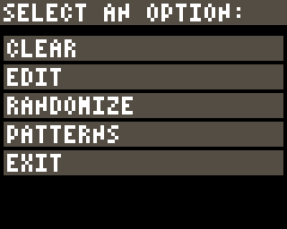
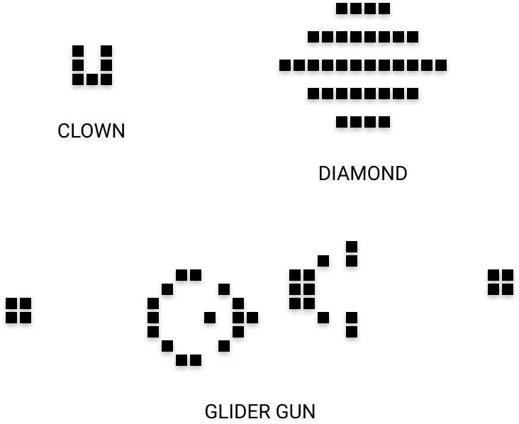
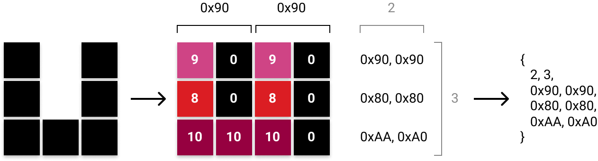
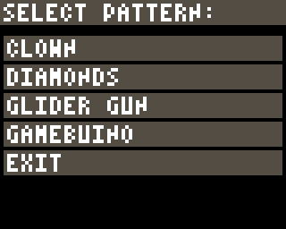

# Finalisation de l'application

Pour terminer ce tutoriel et finaliser notre application, je vous propose de revenir au menu principal, que nous avons introduit dans le chapitre [Interactivité](interactivite.html), et de nous pencher sur l'option `PATTERNS` que nous n'avions pas développée.

{: width="240" height="192" class="shadow" }

Si vous avez regardé la vidéo de la chaîne YouTube [Sciences Étonnantes](https://www.youtube.com/user/ScienceEtonnante) qui traite du [Jeu de la Vie](https://youtu.be/S-W0NX97DB0) dans le chapitre [Les Bases](les-bases.html), vous avez probablement retenu qu'il existe des configurations remarquables de cellules sur l'automate de John Conway. Je vous propose d'en intégrer quelques-unes dans notre application :

{: width="366" height="299" }


## Encodage des motifs

Pour cela, nous allons créer une classe `Pattern` dont le seul but sera de définir les différents motifs avec lesquels nous souhaitons pouvoir paramétrer notre automate cellulaire. Je vous propose de déclarer ces motifs comme des constantes statiques de la classe :

<div class="filename">Pattern.h</div>

```c++
#ifndef GAME_OF_LIFE_PATTERN_H_
#define GAME_OF_LIFE_PATTERN_H_

#include "bootstrap.h"

class Pattern
{
    public:

        // la déclaration des motifs remarquables :
        static const uint8_t CLOWN[];
        static const uint8_t DIAMOND[];
        static const uint8_t GLIDER_GUN[];
        // un motif supplémentaire...
        // on ne pouvait pas ne pas faire un petit clin d'oeil à la console :
        static const uint8_t GAMEBUINO[]; 
};

#endif
```

La vraie question est *comment allons-nous définir ces motifs ?* L'idée est de pouvoir configurer la grille de l'automate avec des valeurs entières comprises entre `0` et `15` (pour un affichage en `16` couleurs). Et vous vous souvenez probalement qu'en utilisant un codage bit à bit, nous pouvions encoder l'état de 2 cellules sur un simple octet. Nous allons donc réutiliser ici ce format d'encodage pour définir les motifs en y ajoutant un peu de couleur. Prenons l'exemple du motif du `CLOWN` :



Vous voyez sur ce schéma le mode opératoire pour obtenir l'encodage du motif sous la forme d'un tableau de `uint8_t` :

```c++
const uint8_t Pattern::CLOWN[] = {
    2, 3,
    0x90, 0x90,
    0x80, 0x80,
    0xAA, 0xA0
};
```

La technique imposant d'encoder les états des cellules par groupes de deux, si un motif contient un nombre impair de cellules en largeur, il suffira simplement d'ajouter une cellule morte (avec la valeur `0`) sur toute la dernière colonne du motif pour retomber sur un nombre pair.

Voilà donc la définition de l'ensemble des motifs :

<div class="filename">Pattern.cpp</div>

```c++
#include "Pattern.h"

const uint8_t Pattern::CLOWN[] = {
    2, 3,
    0x90, 0x90,
    0x80, 0x80,
    0xAA, 0xA0
};

const uint8_t Pattern::DIAMOND[] = {
    6, 9,
    0x00, 0x00, 0x22, 0x22, 0x00, 0x00,
    0x00, 0x00, 0x00, 0x00, 0x00, 0x00,
    0x00, 0x11, 0x11, 0x11, 0x11, 0x00,
    0x00, 0x00, 0x00, 0x00, 0x00, 0x00,
    0x22, 0x22, 0x22, 0x22, 0x22, 0x22,
    0x00, 0x00, 0x00, 0x00, 0x00, 0x00,
    0x00, 0x11, 0x11, 0x11, 0x11, 0x00,
    0x00, 0x00, 0x00, 0x00, 0x00, 0x00,
    0x00, 0x00, 0x22, 0x22, 0x00, 0x00,
};

const uint8_t Pattern::GLIDER_GUN[] = {
    18, 9,
    0x00, 0x00, 0x00, 0x00, 0x00, 0x00, 0x00, 0x00, 0x00, 0x00, 0x00, 0x00, 0x20, 0x00, 0x00, 0x00, 0x00, 0x00,
    0x00, 0x00, 0x00, 0x00, 0x00, 0x00, 0x00, 0x00, 0x00, 0x00, 0x00, 0x20, 0x20, 0x00, 0x00, 0x00, 0x00, 0x00,
    0x00, 0x00, 0x00, 0x00, 0x00, 0x00, 0x11, 0x00, 0x00, 0x00, 0x22, 0x00, 0x00, 0x00, 0x00, 0x00, 0x00, 0x44,
    0x00, 0x00, 0x00, 0x00, 0x00, 0x01, 0x00, 0x01, 0x00, 0x00, 0x22, 0x00, 0x00, 0x00, 0x00, 0x00, 0x00, 0x44,
    0x44, 0x00, 0x00, 0x00, 0x00, 0x10, 0x00, 0x00, 0x10, 0x00, 0x22, 0x00, 0x00, 0x00, 0x00, 0x00, 0x00, 0x00,
    0x44, 0x00, 0x00, 0x00, 0x00, 0x10, 0x00, 0x10, 0x11, 0x00, 0x00, 0x20, 0x20, 0x00, 0x00, 0x00, 0x00, 0x00,
    0x00, 0x00, 0x00, 0x00, 0x00, 0x10, 0x00, 0x00, 0x10, 0x00, 0x00, 0x00, 0x20, 0x00, 0x00, 0x00, 0x00, 0x00,
    0x00, 0x00, 0x00, 0x00, 0x00, 0x01, 0x00, 0x01, 0x00, 0x00, 0x00, 0x00, 0x00, 0x00, 0x00, 0x00, 0x00, 0x00,
    0x00, 0x00, 0x00, 0x00, 0x00, 0x00, 0x11, 0x00, 0x00, 0x00, 0x00, 0x00, 0x00, 0x00, 0x00, 0x00, 0x00, 0x00
};

const uint8_t Pattern::GAMEBUINO[] = {
    24, 9,
    0x55, 0x55, 0x35, 0x55, 0x50, 0x00, 0xEE, 0xEE, 0xEE, 0xEE, 0xEE, 0xEE, 0xEE, 0xEE, 0xEE, 0xEE, 0xEE, 0xEE, 0xEE, 0xEE, 0xEE, 0xEE, 0xEE, 0xEE,
    0x77, 0x77, 0x37, 0x77, 0x70, 0x00, 0x00, 0x00, 0x00, 0x00, 0x00, 0x00, 0x00, 0x00, 0x00, 0x00, 0x00, 0x00, 0x00, 0x00, 0x00, 0x00, 0x00, 0x00,
    0x73, 0x33, 0x33, 0x33, 0x70, 0x00, 0x55, 0x00, 0x55, 0x50, 0x55, 0x55, 0x50, 0x55, 0x50, 0x55, 0x50, 0x50, 0x50, 0x50, 0x55, 0x50, 0x55, 0x50,
    0x77, 0x77, 0x77, 0x77, 0x70, 0x00, 0x70, 0x00, 0x70, 0x70, 0x70, 0x70, 0x70, 0x70, 0x00, 0x70, 0x70, 0x70, 0x70, 0x70, 0x70, 0x70, 0x70, 0x70,
    0x77, 0x33, 0x33, 0x37, 0x70, 0x00, 0x70, 0x70, 0x77, 0x70, 0x70, 0x70, 0x70, 0x77, 0x70, 0x77, 0x00, 0x70, 0x70, 0x70, 0x70, 0x70, 0x70, 0x70,
    0x73, 0x77, 0x37, 0x73, 0x70, 0x00, 0x70, 0x70, 0x70, 0x70, 0x70, 0x70, 0x70, 0x70, 0x00, 0x70, 0x70, 0x70, 0x70, 0x70, 0x70, 0x70, 0x70, 0x70,
    0x77, 0x77, 0x77, 0x77, 0x70, 0x00, 0x66, 0x60, 0x60, 0x60, 0x60, 0x60, 0x60, 0x66, 0x60, 0x66, 0x60, 0x66, 0x60, 0x60, 0x60, 0x60, 0x66, 0x60,
    0x77, 0x77, 0x37, 0x77, 0x70, 0x00, 0x00, 0x00, 0x00, 0x00, 0x00, 0x00, 0x00, 0x00, 0x00, 0x00, 0x00, 0x00, 0x00, 0x00, 0x00, 0x00, 0x00, 0x00,
    0x66, 0x66, 0x66, 0x66, 0x60, 0x00, 0xEE, 0xEE, 0xEE, 0xEE, 0xEE, 0xEE, 0xEE, 0xEE, 0xEE, 0xEE, 0xEE, 0xEE, 0xEE, 0xEE, 0xEE, 0xEE, 0xEE, 0xEE
};

```


## Placement des motifs sur l'automate

Bien... maintenant que nous savons précisément quel est le format d'encodage de nos motifs, nous pouvons facilement implémenter la méthode chargée de paramétrer l'automate pour placer un motif donné en précisant les coordonnées `x` et `y` de la cellule « en haut à gauche » du motif :

<div class="filename">Automaton.h</div>

```c++
class Automaton
{
    public:

        void addPattern(const uint8_t* pattern, uint8_t x, uint8_t y);
    
    // le reste des déclarations reste inchangé
};
```

<div class="filename">Automaton.cpp</div>

```c++
void Automaton::addPattern(const uint8_t* pattern, uint8_t x, uint8_t y) {
    uint8_t w = pattern[0]; // la largeur du motif
    uint8_t h = pattern[1]; // la hauteur du motif
    uint8_t c,l,r;
    size_t i,j;
    for (i=0; i<h; i++) {
        for (j=0; j<w; j++) {
            c = pattern[2 + i*w + j];
            l = (c & 0xF0) >> 4;      // les 4 bits les plus à gauche
            r = c & 0xF;              // les 4 bits les plus à droite
            if (l) { this->grid[x+2*j][y+i]   = l; }
            if (r) { this->grid[x+2*j+1][y+i] = r; }
        }
    }
}

// le reste des définitions reste inchangé
```

Il faut donc maintenant ajouter une méthode dans `AutomatonController` qui permette de propager le motif jusqu'à son modèle `Automaton` (puisque `GameController` sollicitera `AutomatonController` pour effectuer cette opération) :

<div class="filename">AutomatonController.h</div>

```c++
class AutomatonController
{
    public:

        void addPattern(const uint8_t* pattern, uint8_t x, uint8_t y);
    
    // le reste des déclarations reste inchangé
};
```

<div class="filename">AutomatonController.cpp</div>

```c++
void AutomatonController::addPattern(const uint8_t* pattern, uint8_t x, uint8_t y) {
    this->model->addPattern(pattern, x, y);
}

// le reste des définitions reste inchangé
```

On fait la même chose dans `GameController` puisqu'au départ ce sera `UserController` qui invoquera cette méthode en envoyant un message au contrôleur principal de l'application, après qu'il en ait reçu l'ordre à la réception d'un événement utilisateur :

<div class="filename">GameController.h</div>

```c++
class GameController
{
    public:

        void addPattern(const uint8_t* pattern, uint8_t x, uint8_t y);
    
    // le reste des déclarations reste inchangé
};
```

<div class="filename">GameController.cpp</div>

```c++
void GameController::addPattern(const uint8_t* pattern, uint8_t x, uint8_t y) {
    this->automatonController->addPattern(pattern, x, y);
}
```


## Gestion des événements utilisateur

Et il ne nous reste plus qu'à gérer la prise en compte de l'événement utilisateur dans `UserController`. Lorsque l'utilisateur sélectionne l'option `PATTERNS` dans le menu principal, il faut que l'application lui propose un nouveau menu qui lui permette de choisir quel motif appliquer à l'automate cellulaire :

<table class="picture-board">
    <tbody>
        <tr>
            <td></td>
            <td style="vertical-align:middle;">&#10230;</td>
            <td></td>
        </tr>
    </tbody>
</table>

Pour cela, voyons comment redéclarer notre classe `UserController` :

<div class="filename">UserController.h</div>

```c++
// Il faut intégrer la déclaration de la classe qui définit les motifs :
#include "Pattern.h"

class UserController
{
    private:

        // déclarer un tableau d'entrées pour notre noouveau menu :
        static const char* PATTERN_MENU[];

        // ajouter une méthode pour afficher ce menu :
        void openPatternMenu();

        // le reste des déclarations reste inchangé
};

```

Il ne reste plus qu'à définir ces nouveaux éléments et ajouter la gestion des événements utilisateurs qui y sont associés :

<div class="filename">UserController.cpp</div>

```c++
// la définition du nouveau menu
const char* UserController::PATTERN_MENU[] = {
    "CLOWN",
    "DIAMONDS",
    "GLIDER GUN",
    "GAMEBUINO",
    "EXIT"
};

void UserController::openMainMenu() {
    GameController* gc = this->gameController;
    gc->stop();
    
    uint8_t selected = gb.gui.menu("SELECT AN OPTION:", MAIN_MENU);

    switch (selected) {
        case 0:
            gc->clear();
            break;
        case 1:
            gc->startEdit();
            break;
        case 2:
            gc->randomize();
            break;
        case 3:
            // ouverture du menu des motifs :
            this->openPatternMenu();
            break;
    }

    gc->update();
}

void UserController::openPatternMenu() {
    GameController* gc = this->gameController;

    uint8_t selected = gb.gui.menu("SELECT AN OPTION:", PATTERN_MENU);

    // Si l'utilisateur choisit d'appliquer un motif, c'est-à-dire qu'il
    // n'aura pas sélectionné la dernière option du menu `EXIT` :
    if (selected != 4) {
        // alors on nettoie l'automate avant d'appliquer le motif
        gc->clear();
    }

    switch (selected) {
        case 0:
            gc->addPattern(Pattern::CLOWN, 38, 26);
            break;
        case 1:
            // dans le cas où l'utilisateur choisit le motif `DIAMOND`
            // on applique deux fois ce motif à deux endroits différents
            // sur l'automate... juste pour le fun ;-)
            gc->addPattern(Pattern::DIAMOND, 18, 18);
            gc->addPattern(Pattern::DIAMOND, 50, 42);
            break;
        case 2:
            gc->addPattern(Pattern::GLIDER_GUN, 10, 10);
            break;
        case 3:
            gc->addPattern(Pattern::GAMEBUINO, 16, 27);
            break;
    }
}

// le reste des définitions reste inchangé
```

Et voilà ce que ça donne si l'utilisateur choisit par exemple le motif du `CLOWN` :

{: width="320" height="256" class="shadow" }

Voilà, l'application est désormais **TERMINÉE** ! Le code source complet de cette septième et dernière version est [disponible ici]({{ site.github.repository_url | append: '/blob/master/sources/v7/GameOfLife/' }}).
