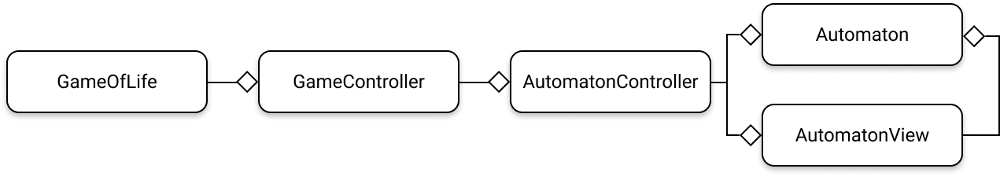
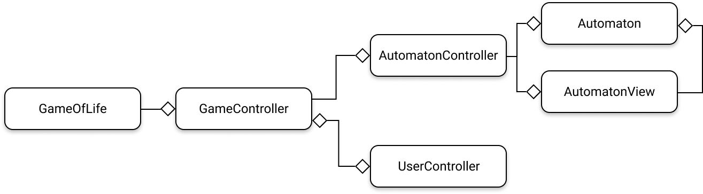
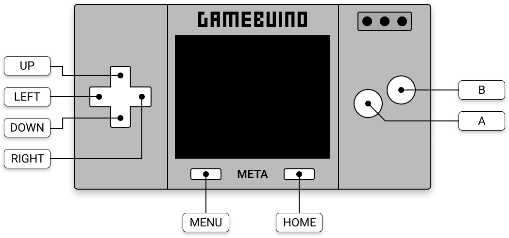
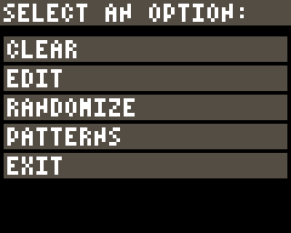

# Mise en place d'un contrôleur principal

Au fil des améliorations que nous allons apporter à notre application à partir de maintenant, nous allons ajouter différents modules spécialisés dans la gestion de telle ou telle fonctionnalité. Nous allons donc définir de nouvelles classes et l'architecture de l'application va se ramifier, se complexifier, progressivement. Aussi, nous devons veiller à bien respecter les principes de programmation que nous avons vus dans les deux derniers chapitres concernant la POO et l'architecture MVC, pour continuer à garantir une organisation logique du code, facile à maintenir.

En particulier, nous allons commencer par créer un gestionnaire principal de notre application, qui est un contrôleur en soi, et que nous nommerons `GameController`. Il jouera le rôle d'ordonnanceur en chef en quelque sorte. C'est le rôle que jouait notre programme principal `GameOfLife.ino` jusque-là, mais allons au bout de la démarche et créons une classe à part entière chargée d'assurer ce rôle. Nous ne laisserons, en définitive, que très peu de choses dans le programme principal, profitant uniquement des points d'entrées obligatoires `setup()` et `loop()` dans tout programme **Arduino** (et *a fortiori* **Gamebuino**) :

<div class="filename">GameOfLife.ino</div>

```c++
#include "bootstrap.h"
#include "GameController.h"

GameController* gameController;

void setup() {
    gb.begin();

    gameController = new GameController();
    gameController->begin();
    
}

void loop() {
    while (!gb.update());

    gameController->loop();
}
```

Il ne nous reste plus qu'à créer notre contrôleur en chef `GameController`, dans lequel nous allons déporter toute la gestion du contrôleur de notre automate cellulaire :

<div class="filename">GameController.h</div>

```c++
#ifndef GAME_OF_LIFE_GAME_CONTROLLER_H_
#define GAME_OF_LIFE_GAME_CONTROLLER_H_

#include "AutomatonController.h"

class GameController
{
    private:

        AutomatonController* automatonController;

        void initAutomatonController();

    public:

        GameController();
        
        void begin();
        void loop();
};

#endif
```

<div class="filename">GameController.cpp</div>

```c++
#include "GameController.h"

GameController::GameController() {
    this->initAutomatonController();
}

void GameController::initAutomatonController() {
    Automaton* automaton = new Automaton();
    AutomatonView* automatonView = new AutomatonView(automaton);
    this->automatonController = new AutomatonController(automaton, automatonView);
}

void GameController::begin() {
    this->automatonController->begin();
}

void GameController::loop() {
    this->automatonController->loop();
}
```

Voilà un schéma de l'architecture actuelle de notre application :



Sans rentrer dans les détails, ce schéma décrit un graphe de dépendances, et considérez que chaque connexion assortie d'un petit losange `♢` indique une association sémantique entre les deux élements connectés que l'on appelle une *agrégation*. `A—♢B` indique qu'une instance de `A` possède une référence vers une instance de `B`.

On peut aussi s'amuser à tracer un diagramme des flux de contrôle qui circulent entre chaque module de l'architecture :


# Contrôleur des événements utilisateur

Maintenant que nous avons une architecture solide, nous allons pouvoir y ajouter des modules spécialisés. Nous allons commencer par un module chargé d'assurer l'interface avec l'utilisateur et de capter tous les événements qu'il est susceptible d'émettre en actionnant les boutons de la console. Ce module est un contrôleur et nous le nommerons `UserController`.



Vous remarquerez la double agrégation entre `GameController` et `UserController`. Elle signifie que, non seulement une instance de `GameController` possède une référence vers une instance de `UserController`, mais également que l'instance de `UserController` possède une référence vers l'instance de `GameController`. En effet, lorsque `GameController` entrera dans sa boucle `loop()`, par exemple, il invoquera la boucle `loop()` de `UserController`, exactement comme il le fait avec `AutomatonController`. Il aura donc forcément besoin d'une référence vers `UserController`. Mais à son tour, lorsqu'un événement utilisateur surviendra, `UserController` devra faire remonter cet événement auprès de `GameController` pour que celui-ci décide quelle action exécuter en fonction de cet événement. Cette double dépendance introduit une sorte de cycle entre les deux objets. Et il s'agit d'une interdépendance qui va nous poser un problème au niveau de la déclaration de nos classes. Nous allons le voir. Commençons par regarder comment modifier la déclaration de `GameController` pour intégrer la relation d'agrégation avec `UserController` :

<div class="filename">GameController.h</div>

```c++
#ifndef GAME_OF_LIFE_GAME_CONTROLLER_H_
#define GAME_OF_LIFE_GAME_CONTROLLER_H_

#include "AutomatonController.h"
#include "UserController.h"

class GameController
{
    private:

        AutomatonController* automatonController;
        UserController* userController;

        void initAutomatonController();
        void initUserController();

    public:

        GameController();
        void begin();
        void loop();
};

#endif
```

Jusque là tout va bien. Regardons maintenant comme déclarer notre nouvelle classe `UserController` et de quelle façon nous allons y intégrer la relation d'agrégation avec `GameController` :

<div class="filename">UserController.h</div>

```c++
#ifndef GAME_OF_LIFE_USER_CONTROLLER_H_
#define GAME_OF_LIFE_USER_CONTROLLER_H_

#include "GameController.h";

class UserController
{
    private:
        
        GameController* gameController;

    public:

        UserController(GameController* gameController);
        void begin();
        void loop();
};

#endif
```

Est-ce que vous devinez où va se poser le problème ?...

> Mettez-vous à la place du compilateur, et plus précisément à la place du préprocesseur, pour tenter d'interpréter les instructions dans l'ordre séquentiel où elles sont lues. Vous ne voyez toujours rien ?...

Le préprocesseur entre dans le header `GameController.h` et commence à lire les directives. Il rencontre les *`#include` Guards*... très bien... puis il inclue la déclaration de la classe `AutomatonController` en incorporant son fichier d'en-tête... ok, pas de problème... puis il va tenter de faire la même chose avec le fichier d'en-tête de `UserController`... il entre donc dans `UserController.h` et continue à lire les directives qu'il rencontre... il passe les *`#include` Guards*... pas de soucis... puis il arrive sur la la directive `#include "GameController.h"` ! Et là ? que se passe-t-il ? Ben il plonge à nouveau dans le fichier `GameController.h` dans lequel il va renconter à nouveau la directive `#include "UserController.h"` qui le fera encore replonger dans ce fichier... etc. etc. etc. Il s'ensuit une boucle infinie qu'on appelle une redondance cyclique, de laquelle il ne peut sortir !

Mais alors comment faire ??? Pour déclarer `GameController` on a besoin de la déclaration de `UserController`... et pour déclarer `UserController` on a besoin de la déclaration de `GameController`... Nous voilà pris au piège !

Pour sortir de ce mauvais pas, il vaut mieux éviter d'avoir à gérer des interdépendances de la sorte... ok... mais bon, si elles ont un sens. Si leur présence est logique, voire nécessaire. Il faut bien qu'on puisse le faire, n'est-ce pas ? Et croyez-moi, ce genre d'interdépendances arrive assez souvent, surtout dans de grosses applications.

Heureusement, C++ nous propose un dispositif pour traiter ces dépendances cycliques. Il s'agit de ce que l'on appelle une déclaration *anticipée* (ou *avancée*) : une *forward declaration* dans le jargon anglophone. Je vous invite à lire [cet article](http://jatinganhotra.com/blog/2012/11/25/forward-class-declaration-in-c-plus-plus/) sur le sujet qui explique bien dans quels cas on peut mettre en place ce dispositif.

Et voilà la solution :

<div class="filename">UserController.h</div>

```c++
#ifndef GAME_OF_LIFE_USER_CONTROLLER_H_
#define GAME_OF_LIFE_USER_CONTROLLER_H_

// ne pas inclure la déclaration pour briser le cycle
// #include "GameController.h";

// et promettre au compilateur que la classe sera bien déclarée plus tard
// en effectuant une déclaration anticipée de cette classe :
class GameController;

class UserController
{
    private:
        
        GameController* gameController;

    public:

        UserController(GameController* gameController);
        void begin();
        void loop();
};

#endif
```

De cette manière le cercle vicieux est brisé : la class `UserController` peut effectivement être déclarée normalement. Une fois que le préprocesseur a terminé la lecture de ce fichier de déclaration, il retourne dans le fichier `GameController.h` et poursuit la déclaration (complète cette fois) de la classe `GameController`. Et tout est bien qui finit bien.

Il faudra par contre bien veiller à inclure le fichier d'en-tête `GameController.h` dans la **définition** de la classe `UserController` de façon à ce que la classe `GameController` soit définie elle-même avant de définir `UserController` :

<div class="filename">UserController.cpp</div>

```c++
#include "bootstrap.h"
#include "UserController.h"
// ne pas oublier de faire cette inclusion :
#include "GameController.h"

UserController::UserController(GameController* gameController) : gameController(gameController) {

}

void UserController::begin() {

}

void UserController::loop() {

}
```

Et voici finalement la définition de la classe `GameController` qui intègre la gestion du contrôleur `UserController` :

<div class="filename">GameController.cpp</div>

```c++
#include "GameController.h"

GameController::GameController() {
    this->initAutomatonController();
    this->initUserController();
}

void GameController::initAutomatonController() {
    Automaton* automaton = new Automaton();
    AutomatonView* automatonView = new AutomatonView(automaton);
    this->automatonController = new AutomatonController(automaton, automatonView);
}

void GameController::initUserController() {
    this->userController = new UserController(this);
}

void GameController::begin() {
    this->userController->begin();
    this->automatonController->begin();
}

void GameController::loop() {
    this->userController->loop();
    this->automatonController->loop();
}
```

Rien de compliqué en définitive : les flux de contrôle s'enchaînent respectivement au travers des méthodes `begin()` et `loop()`, à partir du contrôleur principal, à destination des méthodes analogues des contrôleurs *asservis*.

Pour le moment, `UserController` ne fait rien : aucun événement utilisateur n'est intercepté à son niveau. Nous allons donc mettre en place dès maintenant un dispositif pour, par exemple, permettre d'arrêter et de relancer la simulation.


# Arrêter et relancer la simulation

Pour cela, il suffit d'implanter une sort de bascule au sein du contrôleur principal qui lui permette alternativement de stopper ou de redémarrer les cycles de simulation. Nous allons donc déclarer une variable d'état qui caractérise un mode de gestion du contrôle, basculant entre deux états possibles : la suspension ou l'exécution des cycles de simulation.

<div class="filename">GameController.h</div>

```c++
class GameController
{
    private:

        static const uint8_t STATE_SUSPENDED;
        static const uint8_t STATE_RUNNING;

        // cet attribut prendra l'une des valeurs déclarées
        // par les constantes ci-dessus
        uint8_t state;
    
    public:

        void start();
        void stop();
        bool isWaiting();
    
    // le reste des déclarations reste inchangé
};
```

Voyons comment définir la gestion de ce nouveau dispositif :

<div class="filename">GameController.cpp</div>

```c++
#include "GameController.h"

const uint8_t GameController::STATE_SUSPENDED = 0;
const uint8_t GameController::STATE_RUNNING   = 1;

GameController::GameController() : state(STATE_RUNNING) {
    this->initAutomatonController();
    this->initUserController();
}

void GameController::loop() {
    this->userController->loop();

    if (this->state == STATE_RUNNING) {
        this->automatonController->loop();
    }
}

void GameController::start() {
    this->state = STATE_RUNNING;
}

void GameController::stop() {
    this->state = STATE_SUSPENDED;
}

bool GameController::isWaiting() {
    return this->state == STATE_SUSPENDED;
}

// le reste des définitions reste inchangé
```

Voilà, notre contrôleur principal est prêt à réagir aux événements utilisateur. Il ne reste plus qu'à les intercepter grâce à notre contrôleur `UserController` :

<div class="filename">UserController.cpp</div>

```c++
// il suffit de redéfinir la fonction `loop()` de la façon suivante :

void UserController::loop() {
    // pour être plus concis dans la suite :
    GameController* gc = this->gameController;

    if (gc->isWaiting()) {

        if (gb.buttons.pressed(BUTTON_A)) {
            gc->start();
        }

    } else {

        if (gb.buttons.pressed(BUTTON_B)) {
            gc->stop();
        }

    }
}
```

La disposition des boutons sur la META est la suivante :

{: width="524" height="246" }

Nous pourrions ajouter un mécanisme supplémentaire qui nous permette d'avancer la simulation pas à pas lorsqu'elle est suspendue. Par exemple, faire en sorte qu'à chaque nouvel appui sur le bouton `B` la simulation progresse d'un cycle. Et si l'utilisateur maintient le bouton `B` enfoncé, la simulation progresse alors lentement, pas à pas.

Rien de plus simple... modifions légèrement le contrôleur principal en lui ajoutant une méthode `step()` pour gérer le pas à pas :

<div class="filename">GameController.h</div>

```c++
class GameController
{
    // le reste des déclarations reste inchangé

    public:
    
        void step();
};
```

<div class="filename">GameController.cpp</div>

```c++

void GameController::step() {
    this->automatonController->step();
}
```

Il nous faut donc définir le même mécanisme de pas à pas dans le contrôleur de l'automate cellulaire :

<div class="filename">AutomatonController.h</div>

```c++
class AutomatonController
{
    // le reste des déclarations reste inchangé

    public:

        void step();
};
```

<div class="filename">AutomatonController.cpp</div>

```c++
void AutomatonController::loop() {
    // il suffit juste de déplacer ces instructions dans la méthode `step()` :
    // this->model->step();
    // this->view->draw();
    this->step();
}

void AutomatonController::step() {
    this->model->step();
    this->view->draw();
}
```

Et il ne nous reste plus qu'à intercepter ces nouveaux événements utilisateur :

<div class="filename">UserController.cpp</div>

```c++
void UserController::loop() {
    GameController* gc = this->gameController;

    if (gc->isWaiting()) {

        if (gb.buttons.pressed(BUTTON_A)) {
            gc->start();
        } else if (gb.buttons.pressed(BUTTON_B)) {
            gc->step();
        } else if (gb.buttons.repeat(BUTTON_B, 3)) {
            // si le bouton est resté enfoncé pendant 3 frames...
            // (plus le nombre de frames est grand, plus longue sera la "pause")
            gc->step();
        }

    } else {

        if (gb.buttons.pressed(BUTTON_B)) {
            gc->stop();
        }

    }
}
```

Reportez vous à la doc officielle pour examiner la différence entre les fonctions [`gb.buttons.pressed()`](https://www.gamebuino.com/academy/reference/gb-buttons-pressed) et [`gb.buttons.repeat()`](https://www.gamebuino.com/academy/reference/gb-buttons-repeat).

Vous voyez comme il est commode d'ajouter de nouvelles fonctionnalités avec une telle architecture ? Le code est très facile à faire évoluer. Chaque composant est spécialisé dans un domaine d'activité. Il est donc très facile de modifier un comportement spécifique. Une action traitée dans un composant peut éventuellement être propagée dans les composants auxquels il est lié. Mais cette propagation reste très simple à gérer. On sait exactement où intervenir. La logique du code est parfaitement modularisée.

Si nous souhaitons ajouter d'autres fonctionnalités interactives, nous allons vite nous retrouver limités par le nombre de boutons de la console. Nous allons donc plutôt envisager d'ajouter un menu d'options que l'utilisateur pourra sélectionner plus facilement.


# Ajout du menu principal

La bibliothèque `Gamebuino-Meta` nous propose heureusement un composant tout prêt pour réaliser cela, nous n'aurons pas à le coder... Juste à le paramétrer. Cool !

Voilà le menu que nous souhaitons afficher à l'utilisateur lorsque celui-ci appuiera sur le bouton... `MENU` de la console :

{: width="240" height="192" class="shadow" }

Vous allez voir que c'est très simple. Commençons par modifier légèrement la déclaration de la classe `UserController` pour y intégrer la gestion de ce menu :

<div class="filename">UserController.h</div>

```c++
class UserController
{
    private:

        // le tableau des éléments du menu :
        static const char* MAIN_MENU[];

        // nous allons déplacer toutes les instructions qui se trouvent
        // dans notre version actuelle de la méthode `loop()` dans cette
        // nouvelle méthode :
        void checkButtons();
        // et placer le code nécessaire à la gestion du menu principal
        // dans celle-ci :
        void openMainMenu();
    
    // les autres déclarations restent inchangées
};
```

Et définissons ces nouveaux éléments :

<div class="filename">UserController.cpp</div>

```c++
const char* UserController::MAIN_MENU[] = {
    "CLEAR",
    "EDIT",
    "RANDOMIZE",
    "PATTERNS",
    "EXIT"
};

void UserController::loop() {
    if (gb.buttons.pressed(BUTTON_MENU)) {
        this->openMainMenu();
    } else {
        this->checkButtons();
    }
}

void UserController::checkButtons() {
    GameController* gc = this->gameController;

    if (gc->isWaiting()) {

        if (gb.buttons.pressed(BUTTON_A)) {
            gc->start();
        } else if (gb.buttons.pressed(BUTTON_B)) {
            gc->step();
        } else if (gb.buttons.repeat(BUTTON_B, 3)) {
            gc->step();
        }

    } else {

        if (gb.buttons.pressed(BUTTON_B)) {
            gc->stop();
        }

    }
}

void UserController::openMainMenu() {
    // la fonction `gb.gui.menu` renvoie un entier correspondant
    // à l'index de l'élément du tableau `MAIN_MENU` qui a été
    // seléctionné par l'utilisateur :
    uint8_t selected = gb.gui.menu("SELECT AN OPTION:", MAIN_MENU);
}

// les autres définitions restent inchangées
```

Occupons-nous dès maintenant des options les plus simples :

- `CLEAR` permettra de supprimer toutes les cellules vivantes
- `RANDOMIZE` permettra de générer une nouvelle distribution aléatoire

Notre modèle `Automaton` dispose déjà de la méthode `randomize()` adéquate. Il nous faut par contre ajouter une méthode `clear()` pour éliminer toutes les cellules vivantes. De la même manière, il faudra ajouter la méthode correspondante dans `AutomatonController` puisque nous devrons passer par ce contrôleur pour lui demander d'ordonner à son modèle de déclencher sa méthode `clear()`. Voici les modifications à propager dans ces deux composants :

<div class="filename">Automaton.h</div>

```c++
class Automaton
{
    public:

        void clear();
        void randomize(); // existe déjà
    
    // les autres déclarations restent inchangées
};
```

<div class="filename">AutomatonController.h</div>

```c++
class AutomatonController
{
    public:

        void clear();
        void randomize(); // existe déjà
    
    // les autres déclarations restent inchangées
};
```

<div class="filename">Automaton.cpp</div>

```c++
void Automaton::clear() {
    size_t x,y;
    size_t xsup = W+1; // borne supérieure de x
    size_t ysup = H+1; // borne supérieure de y
    for (y=1; y<ysup; y++) {
        for (x=1; x<xsup; x++) {
            this->grid[x][y] = 0;
        }
    }
}

// cette méthode reste inchangée
void Automaton::randomize() {
    size_t x,y;
    size_t xsup = W+1; // borne supérieure de x
    size_t ysup = H+1; // borne supérieure de y
    for (y=1; y<ysup; y++) {
        for (x=1; x<xsup; x++) {
            this->grid[x][y] = random(0,2) == 0 ? random(1, 4) : 0;
        }
    }
}
    
// les autres définitions restent inchangées
```

<div class="filename">AutomatonController.cpp</div>

```c++
void AutomatonController::clear() {
    this->model->clear();
}

// cette méthode reste inchangée
void AutomatonController::randomize() {
    this->model->randomize();
}

// les autres définitions restent inchangées
```

Et voilà ! Il ne nous reste plus qu'à câbler tout ça avec nos contrôleurs `UserController` et `GameController`. Lorsque `UserController` va intercepter les événements, il va les envoyer au `GameController`. Nous devons donc mettre en place les méthodes qui permettent de recevoir ces événéments au sein du `GameController` :

<div class="filename">GameController.h</div>

```c++
class GameController
{
    public:

        // deux nouvelles déclarations :
        void clear();
        void randomize();
};

// les autres déclarations restent inchangées
```

<div class="filename">GameController.cpp</div>

```c++
// les deux nouvelles définitions correspondantes :

void GameController::clear() {
    this->automatonController->clear();
}

void GameController::randomize() {
    this->automatonController->randomize();
}

// les autres définitions restent inchangées
```

Terminons avec l'interception des événements au sein du `UserController` :

<div class="filename">UserController.cpp</div>

```c++
// Voici comment compléter la méthode `openMainMenu()` :

void UserController::openMainMenu() {
    GameController* gc = this->gameController;

    uint8_t selected = gb.gui.menu("SELECT AN OPTION:", MAIN_MENU);

    switch (selected) {
        case 0:
            gc->clear();
            break;
        case 2:
            gc->randomize();
            break;
    }
}

// les autres définitions restent inchangées
```

Fonctionnellement les choses sont en place. Mais si vous testez l'application maintenant, vous verrez qu'il y a un truc qui cloche. En effet, si la simulation est suspendue, vous constaterez qu'une fois l'option du menu sélectionnée... rien ne semble se passer. Et c'est tout à fait normal : nous devons penser à raffraîchir l'affichage. Jusqu'ici, seule la vue `AutomatonView()` effectue des opérations sur l'écran avec sa méthode `draw()`. En particulier, avant d'afficher la nouvelle génération, elle nettoie l'écran avec `gb.display.clear()`. Mais si la simulation est suspendue, sa méthode `draw()` n'est pas déclenchée. Donc l'écran n'est pas raffraîchi... et donc le menu reste affiché !

Pour remédier à cela, il suffit de faire remonter un ordre de raffraîchissement :

<div class="filename">UserController.cpp</div>

```c++
// Voici comment compléter la méthode `openMainMenu()` :

void UserController::openMainMenu() {
    GameController* gc = this->gameController;

    uint8_t selected = gb.gui.menu("SELECT AN OPTION:", MAIN_MENU);

    switch (selected) {
        case 0:
            gc->clear();
            break;
        case 2:
            gc->randomize();
            break;
    }

    // quelle que soit l'option sélectionnée dans le menu
    // un ordre de rafraîchissement doit remonter au GameController
    gc->update();
}

// les autres définitions restent inchangées
```

Et `GameController` doit alors propager l'ordre de rafraîchissement :

<div class="filename">GameController.h</div>

```c++
class GameController
{
    public:

        void update();

    // les autres déclarations restent inchangées
};
```

<div class="filename">GameController.cpp</div>

```c++
void GameController::update() {
    this->automatonController->update();
}

// les autres définitions restent inchangées
```

<div class="filename">AutomatonController.h</div>

```c++
class AutomatonController
{
    public:

        void update();

    // les autres déclarations restent inchangées
};
```

<div class="filename">AutomatonController.cpp</div>

```c++
void AutomatonController::update() {
    this->view->draw();
}

// les autres définitions restent inchangées
```

Encore un petit détail : lorsque le menu est ouvert par l'utilisateur, on peut aussi trouver naturel de suspendre systématiquement la simulation. Lorsqu'il sortira du menu, il pourra ensuite la relancer ou la faire progresser pas à pas en fonction de ce qu'il préfère. Donc modifions légèrement la méthode `openMainMenu()` pour cela :

<div class="filename">UserController.cpp</div>

```c++
void UserController::openMainMenu() {
    GameController* gc = this->gameController;
    // la simulation est suspendue dès qu'on affiche le menu
    gc->stop();
    
    uint8_t selected = gb.gui.menu("SELECT AN OPTION:", MAIN_MENU);

    switch (selected) {
        case 0:
            gc->clear();
            break;
        case 2:
            gc->randomize();
            break;
    }

    gc->update();
}

// les autres définitions restent inchangées
```


# Gestion du mode d'édition

Ajoutons maintenant une nouvelle fonctionnalité qui permette à l'utilisateur d'éditer la grille de cellules, en direct à l'écran, et de définir ou modifier la configuration de l'automate cellulaire à tout moment. Cette fonctionnalité sera déclenchée par la sélection de l'option `EDIT` dans le menu principal. Il suffit donc d'ajouter la prise en compte de cet événement et de le faire remonter au `GameController` :

<div class="filename">UserController.cpp</div>

```c++
void UserController::openMainMenu() {
    GameController* gc = this->gameController;
    // la simulation est suspendue dès qu'on affiche le menu
    gc->stop();
    
    uint8_t selected = gb.gui.menu("SELECT AN OPTION:", MAIN_MENU);

    switch (selected) {
        case 0:
            gc->clear();
            break;
        case 1:
            // on demande au contrôleur principal
            // de basculer en mode édition
            gc->startEdit();
            break;
        case 2:
            gc->randomize();
            break;
    }

    gc->update();
}

// les autres définitions restent inchangées
```


<div class="filename">GameController.h</div>

```c++
class GameController
{
    private:

        static const uint8_t STATE_SUSPENDED;
        static const uint8_t STATE_RUNNING;
        static const uint8_t STATE_EDITNG;

    public:

        // on ajoute une méthode pour basculer
        // en mode édition :
        void startEdit();
        // ainsi qu'une méthode qui permette
        // de déterminer si le contrôleur est
        // en mode édition ou non :
        bool isEditing();
    
    // les autres déclarations restent inchangées
};
```

<div class="filename">GameController.cpp</div>

```c++
const uint8_t GameController::STATE_SUSPENDED = 0;
const uint8_t GameController::STATE_RUNNING   = 1;
// on définit ce nouvel état :
const uint8_t GameController::STATE_EDITING   = 2;

// on définit la méthode qui va réceptionner l'événement utilisateur :
void GameController::startEdit() {
    this->state = STATE_EDITING;
}

// ainsi que la méthode qui permet de déterminer si
// le contôleur est en mode édition ou non :
bool GameController::isEditing() {
    return this->state == STATE_EDITING;
}

// et on modifie la boucle de contrôle pour prendre
// en compte ce nouvel état :
void GameController::loop() {
    this->userController->loop();

    if (this->state == STATE_RUNNING) {
        this->automatonController->loop();
    } else if (this->state == STATE_EDITING) {
        // Reste ici à déterminer ce que le contrôleur
        // doit faire quand il est en mode édition
    }
}

// les autres définitions restent inchangées
```

Maintenant, nous allons créer un ensemble de modules chargés de gérer les opérations liées à l'édition. Cet ensemble sera composé de trois modules :

- `Editor` (le modèle) sera chargé de gérer le pointeur d'édition piloté par l'utilisateur : il lui permettra de désigner l'emplacement où il souhaite générer une cellule vivante ou, au contraire, désigner la cellule qu'il souhaite supprimer,
- `EditorView` (la vue) sera chargée d'afficher ce pointeur à l'écran,
- `EditorController` (le contrôleur) sera chargé de synchroniser le modèle et la vue, et d'intercepter les événements utilisateurs susceptibles de modifier la position du pointeur, ou encore d'engendrer ou supprimer une cellule.

Voici le schéma de cette nouvelle architecture :


## Le modèle Editor

<div class="filename">Editor.h</div>

```c++
#ifndef GAME_OF_LIFE_EDITOR_H_
#define GAME_OF_LIFE_EDITOR_H_

#include "bootstrap.h"

class Editor
{
    private:

        // les coordonnées du pointeur
        uint8_t x, y;

    public:

        Editor(uint8_t x, uint8_t y);

        // les méthodes d'accès aux coordonnées du pointeur
        uint8_t getX();
        uint8_t getY();
        // les méthodes de déplacement du pointeur
        void up();
        void down();
        void left();
        void right();
};

#endif
```

<div class="filename">Editor.cpp</div>

```c++
#include "Editor.h"

Editor::Editor(uint8_t x, uint8_t y) : x(x), y(y) {

}

uint8_t Editor::getX() {
    return this->x;
}

uint8_t Editor::getY() {
    return this->y;
}

void Editor::up() {
    if (this->y == 0) {
        this->y = H;
    } else {
        this->y--;
    }
}

void Editor::down() {
    if (this->y == H) {
        this->y = 0;
    } else {
        this->y++;
    }
}

void Editor::left() {
    if (this->x == 0) {
        this->x = W;
    } else {
        this->x--;
    }
}

void Editor::right() {
    if (this->x == W) {
        this->x = 0;
    } else {
        this->x++;
    }
}
```

Rien de spécial à signaler concernant le modèle. La lecture du code suffit je pense.


## La vue EditorView

<div class="filename">EditorView.h</div>

```c++
#ifndef GAME_OF_LIFE_EDITOR_VIEW_H_
#define GAME_OF_LIFE_EDITOR_VIEW_H_

#include "bootstrap.h"
#include "Editor.h"

class EditorView
{
    private:

        // une palette de couleurs
        static const Color PALETTE[];
        // la morphologie du pointeur
        static const uint8_t SHAPE[];

        // la référence au modèle
        Editor* model;
        // une horloge interne
        uint8_t clock;
        // la méthode chargée de dessiner le pointeur
        void drawShape();

    public:

        EditorView(Editor* model);

        // la méthode chargée de gérer l'affichage du pointeur
        void draw();
};

#endif
```

<div class="filename">EditorView.cpp</div>

```c++
#include "EditorView.h"

const Color EditorView::PALETTE[] = {
    WHITE,
    LIGHTBLUE
};

// description de la forme du pointeur
// chaque valeur du tableau (hormis les dimensions de la forme)
// est corrélée à l'index de la couleur dans la PALETTE ci-dessus :
// 0 => le pixel est éteint et ne doit pas être dessiné
// 1 => PALETTE[0]
// 2 => PALETTE[1]
const uint8_t EditorView::SHAPE[] = {
    7, 7, // les dimensions de la forme du pointeur
    0, 0, 2, 2, 2, 0, 0,
    0, 0, 0, 1, 0, 0, 0,
    2, 0, 0, 0, 0, 0, 2,
    2, 1, 0, 0, 0, 1, 2,
    2, 0, 0, 0, 0, 0, 2,
    0, 0, 0, 1, 0, 0, 0,
    0, 0, 2, 2, 2, 0, 0
};

EditorView::EditorView(Editor* model) : model(model), clock(0) {

}

// ici on va utiliser l'horloge interne
// pour faire clignotter le pointeur :
// 2 frames sur 4 : on dessine le pointeur
// 2 frames sur 4 : on ne le dessine pas
void EditorView::draw() {
    if (this->clock % 4 < 2) {
        this->drawShape();
    }

    this->clock++;
}

// allez... je vous laisse décortiquer cette méthode
// pour comprendre comment le pointeur est dessiné !
// rien de compliqué ;-) il faut juste tenir compte
// de la topologie torique de l'espace.
void EditorView::drawShape() {
    // la forme à dessiner sera centrée sur les coordonnées du pointeur :
    uint8_t x = this->model->getX();
    uint8_t y = this->model->getY();
    // on récupère les dimensions de la forme à dessiner :
    uint8_t w = SHAPE[0];
    uint8_t h = SHAPE[1];
    // décalage à appliquer sur la forme pour qu'elle
    // soit centrée sur les coordonnées du pointeur
    uint8_t dx = 1 + w/2;
    uint8_t dy = 1 + h/2;
    // les coordonnées des pixels que l'on va afficher
    // notez que ces entiers sont signés !
    int8_t u,v;
    // l'indice de couleur du pixel examiné
    uint8_t c;
    size_t i,j;
    for (i=0; i<w; i++) {
        for (j=0; j<h; j++) {
            // on récupère l'indice de la couleur du point
            // de coordonnées (j,i) de la forme du pointeur
            c = SHAPE[2+j+i*w];
            if (c) { // on ne dessine le pixel que s'il est allumé

                // on calcule les coordonnées du pixel à afficher
                u = x + j - dx;
                v = y + i - dy;

                // et on applique des corrections sur ces coordonnées
                // pour prendre en compte la topologie torique
                if (u < 0) { u += W; }
                if (u > W) { u -= W; }
                if (v < 0) { v += H; }
                if (v > H) { v -= H; }

                gb.display.setColor(PALETTE[c-1]);
                gb.display.drawPixel(u, v);
            }
        }
    }
}
```

Là aussi, je suppose que les commentaires dans le code sont suffisants...


## Le contrôleur EditorController

<div class="filename">EditorController.h</div>

```c++
#ifndef GAME_OF_LIFE_EDITOR_CONTROLLER_H_
#define GAME_OF_LIFE_EDITOR_CONTROLLER_H_

#include "Editor.h"
#include "EditorView.h"
#include "AutomatonController.h"

class EditorController
{
    private:

        Editor* model;
        EditorView* view;
        // Une référence au contrôleur de l'automate est nécessaire
        // pour pouvoir lui demander d'engendrer ou de supprimer une cellule
        // lorsqu'on intercepte un événement utilisateur dans ce sens
        AutomatonController* automatonController;

    public:

        EditorController(Editor* model, EditorView* view, AutomatonController* automatonController);

        // les points d'entrée classiques de nos contrôleurs :
        void begin();
        void loop();
        // cette méthode permettra de déclencher un rafraîchissement
        // de l'écran
        void update();
};

#endif
```


<div class="filename">EditorController.cpp</div>

```c++
#include "EditorController.h"

EditorController::EditorController(Editor* model, EditorView* view, AutomatonController* automatonController) : model(model), view(view), automatonController(automatonController) {
    
}

void EditorController::begin() {
    // rien de spécial à faire ici
}

void EditorController::loop() {
    // on déclare ces pointeurs pour être plus concis
    // dans l'écriture de la suite :
    Editor* m = this->model;
    AutomatonController* ac = this->automatonController;

    // si l'utilisateur enfonce le bouton A
    if (gb.buttons.repeat(BUTTON_A, 1)) {
        // on demande au contrôleur de l'automate
        // d'engendrer une cellule à la position du pointeur :
        ac->spawn(m->getX(), m->getY());
    // sinon, si l'utilisateur enfonce le bouton B
    } else if (gb.buttons.repeat(BUTTON_B, 1)) {
        // on demande au contrôleur de l'automate
        // de tuer la cellule située à la position du pointeur :
        ac->kill(m->getX(), m->getY());
    }
    
    // gestion du pad directionnel de la console
    // pour déplacer le pointeur :
    if (gb.buttons.repeat(BUTTON_UP, 1)) {
        m->up();
    } else if (gb.buttons.repeat(BUTTON_DOWN, 1)) {
        m->down();
    } else if (gb.buttons.repeat(BUTTON_LEFT, 1)) {
        m->left();
    } else if (gb.buttons.repeat(BUTTON_RIGHT, 1)) {
        m->right();
    }

    // et on déclenche un rafraîchissement de l'écran :
    this->update();
}

// le rafraîchissement consiste à :
void EditorController::update() {
    // demander à l'automate de se raffraîchir
    this->automatonController->update();

    // puis d'afficher une représentation du pointeur
    this->view->draw();
}
```


## Modification de l'automate cellulaire

Il faut maintenant prendre en charge les messages qui sont envoyés à l'automate cellulaire par le biais de son contrôleur et qui seront propagés à son modèle :


<div class="filename">AutomatonController.h</div>

```c++
class AutomatonController
{
    public:

        void spawn(size_t x, size_t y);
        void kill(size_t x, size_t y);

    // le reste des déclarations reste inchangé
};
```

<div class="filename">AutomatonController.cpp</div>

```c++
void AutomatonController::spawn(size_t x, size_t y) {
    this->model->spawn(x, y);
}

void AutomatonController::kill(size_t x, size_t y) {
    this->model->kill(x, y);
}

// le reste des définitions reste inchangé
```

<div class="filename">Automaton.h</div>

```c++
class Automaton
{
    public:

        void spawn(size_t x, size_t y);
        void kill(size_t x, size_t y);

    // le reste des déclarations reste inchangé
};
```

<div class="filename">Automaton.cpp</div>

```c++
void Automaton::spawn(size_t x, size_t y) {
    // on choisit une valeur arbitraire pour faire naître une cellule
    // sachant qu'elle déterminera la couleur avec laquelle elle
    // sera affichée :
    this->grid[x][y] = 2;
}

void Automaton::kill(size_t x, size_t y) {
    this->grid[x][y] = 0;
}

// le reste des définitions reste inchangé
```


## Intégration des modules

Voilà... y avait pas mal de choses à mettre en place finalement ! Maintenant tout est prêt et nous pouvons enfin câbler tout ce que nous venons de créer avec notre contrôleur principal :

<div class="filename">GameController.h</div>

```c++
// Nous devons désormais inclure la déclaration
// de notre contrôleur d'édition :
#include "EditorController.h"

class GameController
{
    private:

        // les 3 états possibles du contrôleur :
        static const uint8_t STATE_SUSPENDED;
        static const uint8_t STATE_RUNNING;
        static const uint8_t STATE_EDITNG;

        // on ajoute notre contrôleur d'édition :
        EditorController* editorController;

        // la méthode qui nous permettra de créer l'instance
        // de notre contrôleur d'édition :
        void initEditorController();

    public:

        // la méthode pour basculer en mode édition :
        void startEdit();
        // on ajoute une méthode pour sortir du mode édition :
        void stopEdit();
        // et la méthode qui détermine si on est en mode édition ou non :
        bool isEditing();
    
    // les autres déclarations restent inchangées
};
```
Au passage, vous remarquerez que nous avons ajouté une méthode `stopEdit()` qui nous permette de sortir du mode d'édition. Cette méthode sera invoquée par le `UserController` tout à l'heure...

<div class="filename">GameController.cpp</div>

```c++
// instanciation des modules chargés de gérer l'édition :
void GameController::initEditorController() {
    Editor* editor = new Editor(W/2, H/2);
    EditorView* editorView = new EditorView(editor);
    this->editorController = new EditorController(editor, editorView, this->automatonController);
}

void GameController::begin() {
    this->automatonController->begin();
    // initialisation du contrôleur d'édition
    this->editorController->begin();
    this->userController->begin();
}

void GameController::loop() {
    this->userController->loop();

    if (this->state == STATE_RUNNING) {
        this->automatonController->loop();
    } else if (this->state == STATE_EDITING) {
        // voilà précisément ce que doit faire le contrôleur principal
        // quand il est en mode édition :
        this->editorController->loop();
    }
}

void GameController::startEdit() {
    this->state = STATE_EDITING;
}

// sortir du mode d'édition revient simplement
// à repasser en mode simulation suspendue
void GameController::stopEdit() {
    this->state = STATE_SUSPENDED;
}

bool GameController::isEditing() {
    return this->state == STATE_EDITING;
}

// le reste des définitions reste inchangé
```

Pour terminer, revenons au `UserController` au sein duquel nous allons simplement ajouter la routine qui nous permettra de sortir du mode d'édition. Pour sortir du mode d'édition, on demandera simplement à l'utilisateur de rappuyer sur le bouton `MENU` :

<div class="filename">UserController.cpp</div>

```c++
void UserController::loop() {
    GameController* gc = this->gameController;

    // lorsque l'on appuie sur le bouton MENU :
    if (gb.buttons.pressed(BUTTON_MENU)) {

        // et si on était en mode d'édition :
        if (gc->isEditing()) {
            // et bien on en sort !
            gc->stopEdit();
            // et on n'oublie pas de déclencher un rafraîchissement :
            gc->update();
        } else {
            // sinon on ouvre simplement le menu :
            this->openMainMenu();
        }

    } else {
        // si le bouton MENU n'a pas été enfoncé,
        // on vérifie tous les autres boutons :
        this->checkButtons();
    }
}

void UserController::checkButtons() {
    GameController* gc = this->gameController;

    if (gc->isWaiting()) {

        if (gb.buttons.pressed(BUTTON_A)) {
            gc->start();
        } else if (gb.buttons.pressed(BUTTON_B)) {
            gc->step();
        } else if (gb.buttons.repeat(BUTTON_B, 3)) {
            gc->step();
        }
    // attention : on place ici un garde-fou !
    // en effet, dans le mode édition, le bouton B a une autre fonction.
    // on doit donc s'assurer qu'on n'est pas en mode d'édition pour
    // lui laisser jouer son rôle "par défaut" :
    } else if (!gc->isEditing()) {

        if (gb.buttons.pressed(BUTTON_B)) {
            gc->stop();
        }

    }
}

// le reste des définitions reste inchangé
```

Voilà... je crois n'avoir rien oublié... (enfin j'espère). Le code source complet de cette cinquième version est [disponible ici]({{ site.github.repository_url | append: '/blob/master/sources/v5/GameOfLife/' }}). Relisez-le bien, à tête reposée... parce-que ça commence à être touffu. Mais vous voyez qu'on n'a pas dérogé aux règles de construction selon l'architecture MVC et que chaque composant est à sa place et gère ce qu'il a à gérer. Vous devez commencer à réaliser à quel point cette architecture permet de simplifier la logique globale de l'application.

Juste pour le fun, et pour clore ce chapitre en images, voici une petite démonstration de notre mode d'édition en action :

{: width="320" height="256" class="shadow" }

> L'option `PATTERNS` dans le menu sera exploitée dans un prochain chapitre  <i class="far fa-smile-wink"></i>
