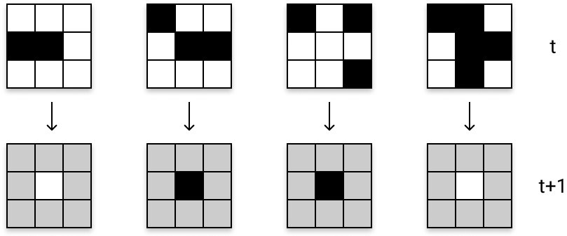
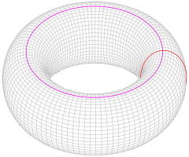
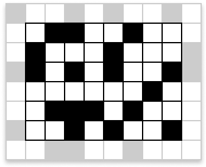
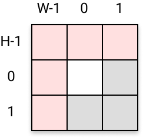
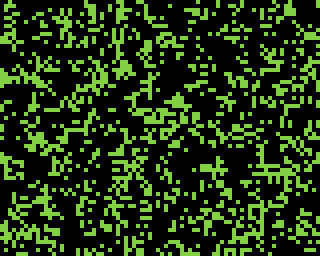
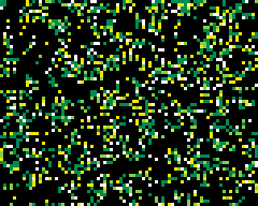

# Un peu d'histoire...

On doit l'origine de ce *jeu* (qui n'en est pas vraiment un) au mathématicien et physicien [John von Neumann](https://fr.wikipedia.org/wiki/John_von_Neumann) qui, alors qu'il travaillait sur des systèmes auto-réplicatifs dans les années 1940, tentait de mettre au point un modèle de robot capable de se copier lui-même à partir d'un ensemble de pièces détachées. Confronté à certaines difficultés du monde physique, von Neumann décida de concevoir un modèle mathématique abstrait permettant de décrire son problème. Le résultat fut le tout premier *automate cellulaire*, connu comme le *copieur et constructeur universel*.

Un automate cellulaire consiste en une grille régulière de « cellules » caractérisées chacune par un « état » choisi parmi un ensemble fini et qui peut évoluer au cours du temps. L'état d'une cellule au temps `t+1` est fonction de l'état au temps `t` d'un nombre fini de cellules appelé son « voisinage ». À chaque nouvelle unité de temps, les mêmes règles sont appliquées simultanément à toutes les cellules de la grille, produisant une nouvelle « génération » de cellules dépendant entièrement de la génération précédente.

L'automate de von Neumann était basé sur une grille à deux dimensions où chaque cellule pouvait prendre 29 états. Von Neumann y construisit un motif particulier et démontra qu'il pouvait produire sans fin des copies de lui-même. Cette trouvaille inspira, 30 ans plus tard, un autre mathématicien, [John Horton Conway](https://fr.wikipedia.org/wiki/John_Horton_Conway), qui s'attacha à simplifier les idées de von Neumann et finit par concevoir un automate cellulaire qui connut un grand succès dans les années 1970 auprès de la communauté informatique naissante : [le Jeu de la Vie](https://fr.wikipedia.org/wiki/Jeu_de_la_vie).


# Le Jeu de la Vie

Il se déroule sur une grille à deux dimensions, théoriquement infinie, mais que nous allons adapter pour la Gamebuino META, dont l'écran n'offre qu'une grille de pixels aux dimensions finies. Vous l'aurez compris : à l'écran, chaque cellule de l'automate sera représentée par un pixel. Et nous attribuerons une couleur à chaque pixel, qui caractérisera l'état de la cellule qu'il représente.

Dans le jeu de la vie, chaque cellule peut prendre deux états distincts : « vivante » ou « morte ». À chaque génération, l'évolution d'une cellule est entièrement déterminée par l'état de ses huit voisines, selon les règles suivantes :

- une cellule morte possédant exactement trois voisines vivantes devient vivante (elle naît),
- une cellule vivante possédant deux ou trois voisines vivantes le reste (elle survit), sinon elle meurt.

Vous voyez que les règles du *jeu* sont excessivement simples ! <i class="far fa-smile-wink"></i>

Si on choisit de représenter une cellule vivante par une case noire et une cellule morte par une case blanche, voici quelques configurations qui illustrent les règles énoncées (on ne s'intéresse ici qu'à l'évolution de la cellule du centre, dont l'état à l'instant `t+1` est déterminé par l'état de ses huit voisines à l'instant `t`) :

{: width="400" height="170"}

Je vous laisse découvrir la magie que peuvent engendrer ces règles dans une petite vidéo très intéressante, qui vous apprendra que cet automate aux règles locales simplistes renferme d'étonnantes propriétés globales :

<iframe class="shadow" width="560" height="315" src="https://www.youtube.com/embed/S-W0NX97DB0?rel=0" frameborder="0" allow="autoplay; encrypted-media" allowfullscreen></iframe>


# Modélisation de la grille

Sur une grille infinie, chaque cellule possède bien huit voisines... mais sur une grille finie comme l'écran de la META, nous allons avoir un problème pour déterminer le voisinage des cellules de bordure ! Une solution consiste à faire en sorte que la grille se referme sur elle-même, comme si on joignait la bordure du haut avec celle du bas, et celle de gauche avec celle de droite. Imaginez notre grille dessinée sur une feuille de papier. Pour joindre la bordure du haut avec celle du bas, il suffit de rouler la feuille de manière à former un tube. La topologie de la grille devient ainsi cylindrique, et les extrémités du cylindre sont alors les cercles formés respectivement par la bordure de gauche et la bordure de droite. Si maintenant on joint les deux extrémités du cylindre, on forme alors une sorte d'anneau, qu'on appelle un *tore*. La topologie de la grille devient alors torique :

<!-- {: width="214" height="90"} -->

{: width="50%" }

Nous adopterons cette solution pour ne pas avoir à inventer de nouvelles règles concernant les cellules de bordure, ni risquer d'obtenir des comportements singuliers avec des voisinages incomplets. Voici les voisinages que l'on obtient sur les bordures avec une topologie torique :

{: width="170" height="138"}


# Initialisation de la grille

Sur l'écran de la META, nous allons représenter, dans un premier temps, chaque cellule morte par un pixel **noir** (*éteint*) et chaque cellule vivante par un pixel **vert** (*alllumé*). Par conséquent, on peut se limiter à définir une grille de *booléens* (`bool`) où une cellule vivante sera représentée par la valeur `true` et une cellule morte par la valeur `false`. Nous initialiserons notre grille avec une distribution aléatoire de cellules vivantes.

Pour commencer, nous allons créer un fichier `GameOfLife.ino` et y inscrire les lignes suivantes :

```c++
#include <Gamebuino-Meta.h>

#define W 80
#define H 64

bool grid[W][H];

void setup() {
    gb.begin();
    randomize();
    draw();
}

void loop() {
    while (!gb.update());
}

void randomize() {
    size_t x,y;
    for (y=0; y<H; y++) {
        for (x=0; x<W; x++) {
            // on détermine ici la densité de cellules vivantes
            grid[x][y] = random(0,2) == 0;
        }
    }
}

void draw() {
    gb.display.clear();
    gb.display.setColor(LIGHTGREEN);
    uint8_t x,y;
    for (y=0; y<H; y++) {
        for (x=0; x<W; x++) {
            if (grid[x][y]) {
                gb.display.drawPixel(x,y);
            }
        }
    }
}
```

La formule stochastique utilisée pour initialiser la grille dans la fonction `randomize()` permet de définir une densité plus ou moins importante de cellules vivantes au départ. En voici quelques variantes :

{: width="504" height="146"}

On notera également que, lors de l'affichage de la grille (exécuté par la fonction `draw()`), seules les cellules vivantes sont dessinées. En effet, la couleur par défaut du fond étant noire (`BLACK`), il est inutile de dessiner les cellules mortes.


# Implémentation des règles d'évolution

À chaque nouvelle unité de temps, les règles d'évolution sont appliquées simultanément à toutes les cellules de la grille, produisant une nouvelle génération de cellules dépendant entièrement de l'état des cellules à la génération précédente. Par conséquent, nous allons avoir besoin d'une deuxième grille *tampon* pour mémoriser l'état de la génération précédente. Ainsi, à chaque pas de temps de la simulation, il nous suffira de recopier l'état de la grille dans le tampon, et de calculer le nouvel état de la grille à partir du tampon.

Voici comment définir le tampon et la fonction de recopie de l'état courant de la grille :

```c++
bool buffer[W][H];

void bufferize() {
    size_t x,y;
    for (y=0; y<H; y++) {
        for (x=0; x<W; x++) {
            buffer[x][y] = grid[x][y];
        }
    }
}
```

## Calcul du voisinage

Ensuite, pour appliquer les règles d'évolution, nous allons avoir besoin de calculer, pour chaque cellule, le nombre de cellules vivantes présentes dans son voisinage. Le voisinage de la cellule `grid[x][y]` peut être décrit par l'ensemble des cellules `grid[x+j][y+i]` lorsque `i∈[-1,1]` et `j∈[-1,1]` et (`i≠0` ou `j≠0`) :

{: width="281" height="146"}

En effet, le cas où `i=0` et `j=0` correspond à la cellule `grid[x][y]`, c'est-à-dire la cellule centrale... qui ne fait bien sûr pas partie de son propre voisinage !

Si on traduit tout ceci par du code, voici comment pourrait s'écrire la fonction `neighbours(x,y)` chargée de calculer le nombre de cellules vivantes dans le voisinage de `grid[x][y]` :

```c++
uint8_t neighbours(uint8_t x, uint8_t y) {
    uint8_t n;
    int8_t i,j;
    for (i=-1; i<2; i++) {
        for (j=-1; j<2; j++) {
            if (i != 0 || j != 0) {
                // on effectue le calcul sur la génération précédente
                // donc en utilisant le tampon `buffer`
                if (buffer[x+j][y+i]) {
                    n++;
                }
            }
        }
    }
    return n;
}
```

Mais **attention**, il faut prendre quelques précautions : n'oublions pas que nous travaillons sur un espace clos et fini et que cette fonction doit aussi pouvoir s'appliquer aux cellules de bordure sans risquer de provoquer une erreur. Nous devons donc apporter une petite correction aux coordonnées `x+j` et `y+i` pour ne pas risquer de sortir des limites du tableau `grid`. En effet, prenons l'exemple de la cellule de coordonnées `(0,0)`. Son voisinage est constitué des cellules dont les coordonnées sont les suivantes :

{: width="122" height="118"}

Aussi, toutes les cellules de la frange du haut n'ont pas pour ordonnée `-1` (on serait en dehors de la grille) mais `H-1`. De la même façon, toutes celles de la frange de gauche n'ont pas pour abscisse `-1` (ici aussi, on serait en dehors de la grille) mais `W-1`.

Plus généralement, voici les corrections que nous devons apporter au calcul des coordonnées des cellules voisines :

```c++
uint8_t neighbours(uint8_t x, uint8_t y) {
    uint8_t n = 0;
    int8_t i,j,u,v;
    for (i=-1; i<2; i++) {
        for (j=-1; j<2; j++) {
            if (i != 0 || j != 0) {
                u = x + j;
                v = y + i;

                if (u == -1) {       // la frange de gauche
                    u = W - 1;
                } else if (u == W) { // la frange de droite
                    u = 0;
                }

                if (v == -1) {       // la frange du haut
                    v = H - 1;
                } else if (v == H) { // la frange du bas
                    v = 0;
                }

                if (buffer[u][v]) {
                    n++;
                }
            }
        }
    }
    return n;
}
```

On pourrait ici utiliser l'opérateur de congruence `%` (on l'appelle aussi `modulo`) pour obtenir un code plus concis :

```c++
u = (u + W) % W;
v = (v + H) % H;
```

Mais les performances à l'exécution s'en trouveraient  dégradées puisque les calculs nécessaires sont plus nombreux dans ce cas...


## Application des règles évolutives

Maintenant que nous disposons de la fonction de calcul du voisinage, nous pouvons implémenter les règles d'évolution qui seront appliquées à chaque pas de simulation :

```c++
void applyRules() {
    uint8_t n;
    size_t x,y;
    for (y=0; y<H; y++) {
        for (x=0; x<W; x++) {
            n = neighbours(x,y);
            if (!grid[x][y]) { // si la cellule est morte
                if (n == 3) {
                    grid[x][y] = true;
                }
            } else { // sinon c'est qu'elle est vivante
                if (n == 2 || n == 3) {
                    // grid[x][y] = true;
                    // en réalité on n'a rien à faire,
                    // puisque la cellule est déjà vivante
                    // donc elle le reste :-)
                } else {
                    grid[x][y] = false;
                }
            }
        }
    }
}
```

## Boucle de simulation

Enfin, il ne reste plus qu'à mettre en place l'exécution des cycles générationnels successifs pour itérer chaque pas de la simulation et admirer (enfin) l'automate s'animer :

```c++

void loop() {
    while (!gb.update());
    step();
}

void step() {
    bufferize();
    applyRules();
    draw();
}
```

Et voilà ce que ça donne (sur une boucle de 10 secondes) :

{: width="320" height="256" class="shadow"}

La capture d'écran ci-dessus reproduit *grosso modo* la vitesse d'exécution de notre code sur la console... vous pouvez constater que ça n'est pas franchement véloce !... Le processeur ne parvient même pas à tenir la fréquence par défaut des 25 frames par secondes (on est ici à environ 9 frames par secondes). Bon ok, la console dispose de ressources de calcul et de mémoire limitées... mais tout de même ! Nous verrons donc dans le prochain chapitre comment optimiser notre code et du même coup accélérer la vitesse d'exécution et diminuer la consommation de RAM.

Bon, mais pour le moment, si on mettait un peu plus de couleurs dans tout ça ?


# Quelques touches de couleurs

L'idée sous-jacente est simple : on peut décider d'attribuer une couleur (choisie sur une palette prédéfinie) à chaque cellule en fonction de son *âge*, c'est-à-dire du nombre de générations auxquelles elle a survécu.

Nous nous appuierons pour cela sur la [palette de couleurs officielle](https://gamebuino.com/creations/color-palettes) de la Gamebuino META, que nous adapterons en indexant ses couleurs dans un ordre différent :

```c++
const Color PALETTE[] = {
    BLACK,
    GREEN,
    LIGHTGREEN,
    WHITE,
    YELLOW,
    BEIGE,
    BROWN,
    ORANGE,
    RED,
    PINK,
    PURPLE,
    DARKBLUE,
    BLUE,
    LIGHTBLUE,
    GRAY,
    DARKGRAY
};
```

Cette palette est de dimension finie et l'index maximal des couleurs disponibles a ici la valeur `15`. Nous devrons donc borner l'âge des cellules par cette valeur pour ne pas dépasser les limites du tableau (on pourrait aussi implémenter un cycle).

Ainsi, plutôt que de caractériser l'état d'une cellule par un simple booléen (`true` si elle est vivante ou `false` si elle est morte), nous allons le caractériser par un entier de `1` à `15` lorsqu'elle est vivante, et par `0` lorsqu'elle est morte.

Il nous faut donc modifier la définition de la grille et du tampon :

```c++
uint8_t grid[W][H];
uint8_t buffer[W][H];
```

Ainsi que la fonction `randomize()` :

```c++
void randomize() {
    size_t x,y;
    for (y=0; y<H; y++) {
        for (x=0; x<W; x++) {
            // chaque cellule vivante est initialisée avec un état
            // compris dans l'intervalle [1,3] pour mettre un peu
            // de couleur dès le départ...
            grid[x][y] = random(0,2) == 0 ? random(1, 4) : 0;
        }
    }
}
```

Et la fonction `applyRules()` :

```c++
void applyRules() {
    uint8_t n;
    size_t x,y;
    for (y=0; y<H; y++) {
        for (x=0; x<W; x++) {
            n = neighbours(x,y);
            if (grid[x][y] == 0) { // si la cellule est morte
                if (n == 3) {
                    grid[x][y] = 1;
                }
            } else { // sinon c'est qu'elle est vivante
                if (n == 2 || n == 3) {
                    if (grid[x][y] != 15) {
                        grid[x][y]++;
                    }
                } else {
                    grid[x][y] = 0;
                }
            }
        }
    }
}
```

La fonction `neighbours(x,y)` reste inchangée quant à elle.

Il ne nous reste plus qu'à adapter la fonction `draw()` de manière à ce qu'elle affiche chaque pixel avec la bonne couleur :

```c++
void draw() {
    uint8_t x,y;
    gb.display.clear();
    for (y=0; y<H; y++) {
        for (x=0; x<W; x++) {
            if (grid[x][y]) {
                gb.display.setColor(PALETTE[grid[x][y]]);
                gb.display.drawPixel(x,y);
            }
        }
    }
}
```

Et voilà ce que ça donne :

{: width="320" height="256" class="shadow"}


# Un soupçon d'interactivité

Dernière petite retouche : faisons en sorte que lorsque l'utilisateur appuie sur le bouton `A` de la console, une nouvelle distribution aléatoire soit générée :

```c++
void loop() {
    while (!gb.update());

    if (gb.buttons.pressed(BUTTON_A)) {
        randomize();
    }

    step();
}
```

Le code source complet de cette première version est [disponible ici]({{ site.github.repository_url | append: '/blob/master/sources/v1/GameOfLife/GameOfLife.ino' }}).