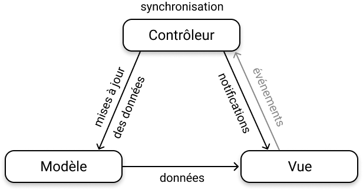

# Architecture Model View Controller

Le *Design Pattern* Model View Controller (communément désigné par le sigle MVC) est une architecture logicielle conçue pour les interfaces graphiques. Créée par l'informaticien norvégien [Trygve Reenskaug](https://fr.wikipedia.org/wiki/Trygve_Reenskaug) alors qu'il était invité au Xerox PARC, elle a été utilisée pour la première fois pour créer des interfaces graphiques avec le langage [Smalltalk](https://fr.wikipedia.org/wiki/Smalltalk) en 1980... *tiens, tiens... les grands esprits se rencontrent à Palo Alto décidément !* D'ailleurs, pour la petite histoire, la légende veut que [Steve Jobs](https://fr.wikipedia.org/wiki/Steve_Jobs) aurait été fortement *inspiré* par une démonstration à laquelle il avait été invité, au Xerox PARC en 1979, pour créer le [Lisa](https://fr.wikipedia.org/wiki/Apple_Lisa) et le [Macintosh](https://fr.wikipedia.org/wiki/Macintosh_128K)...

L'architecture MVC est une organisation tripartite séparant la logique du code en trois modules spécialisés :

- Le **Modèle** encapsule les données manipulées par le programme. Il assure la gestion de ces données et garantit leur intégrité en contrôlant l'accès à ces données (lecture, enregistement et validation des données). Le modèle représente la *logique métier* de l'application.

- La **Vue** contient des éléments visuels pour afficher les données gérées par le modèle. C'est la partie visible de l'interface graphique de l'application. Elle offre à l'utilisateur une (ou plusieurs) représentation(s), partielle(s) ou non, des données du modèle. Dans le cas d'une application où l'utilisateur peut agir directement sur la vue (par un clic de souris par exemple), son rôle est également de capter toutes les actions de l'utilisateur. Ces *événements* sont ensuite envoyés au contrôleur.

- Le **Contrôleur** est chargé de la synchronisation du modèle et de la vue. C'est en quelque sorte le *chef d'orchestre*. Il reçoit tous les événements provenant de l'utilisateur et enclenche les actions à effectuer. Si une action nécessite une modification des données, le contrôleur demande la mise à jour des données au modèle et avertit ensuite la vue que les données ont changé pour que celle-ci se mette à jour à son tour. Dans le cas d'une application où l'utilisateur ne peut pas agir directement sur la vue, mais au travers d'interfaces mécaniques et/ou électroniques comme des boutons ou un joystick (c'est typiquement le cas sur une console de jeux), le contrôleur reçoit alors directement ces événements. Le concepteur de l'application peut également prévoir plusieurs modules spécialisés pour chaque type d'événements.

Voici un schéma des interactions qui relient les trois organes d'une architecture MVC :

{: width="308" height="162" }

Voyons comment réorganiser notre code pour qu'il se conforme à l'architecture MVC.


# Le Modèle

Nul besoin de tergiverser ici... le Modèle est clairement identifié à l'automate cellulaire lui-même, c'est-à-dire à notre classe `Automaton`... à ceci près qu'une de ses méthodes n'a désormais plus sa place dans cette classe. Il s'agit de la méthode `draw()` qui, vous l'aurez compris, est maintenant du ressort de la Vue.

En effet, la Vue se chargera d'exécuter l'affichage de l'automate. Mais pour cela, elle aura nécessairement besoin de connaître l'état des cellules gérées par l'automate. Par conséquent nous devons mettre en place une méthode au sein de l'automate qui permette à la Vue d'accéder à l'état de chaque cellule. Pour dessiner le pixel de coordonnées `(x,y)`, la Vue aura donc besoin d'accéder à l'état de la cellule `grid[x][y]`. Selon le principe d'encapsulation, il est hors de question d'offrir un accès direct à la grille de l'automate. L'accès sera limité à la valeur de l'état d'une cellule et totalement maîtrisé par le Modèle.

Nous pouvons par exemple définir une méthode `getCell(x,y)` qui implémente un accès en lecture à l'état de la cellule de coordonnées `(x,y)`. Et il est évident que cette méthode doive être déclarée comme `public` pour qu'elle puisse être accessible à la Vue.

```c++
uint8_t getCell(size_t x, size_t y);
```

C'est tout ce que nous avons à ajouter à la classe `Automaton` ! Voici donc la nouvelle déclaration de cette classe :

<div class="filename">Automaton.h</div>
```c++
#ifndef GAME_OF_LIFE_AUTOMATON_H_
#define GAME_OF_LIFE_AUTOMATON_H_

#include "bootstrap.h"

class Automaton
{
    private:

        uint8_t grid[W+2][H+2];

        uint8_t duplicate(uint8_t g);
        uint8_t neighbours(size_t x, size_t y);
        void bufferize();
        void applyRules();

    public:

        Automaton();

        // ajout d'une méthode d'accès en lecture
        // à l'état de la cellule grid[x][y] :
        uint8_t getCell(size_t x, size_t y);

        void randomize();
        void step();

        // cette méthode n'a plus rien à faire ici
        // elle doit être déplacée dans la Vue !
        // void draw();
};

#endif
```

Il ne reste donc plus qu'à supprimer la définition de la méthode `draw()` et à ajouter celle de la méthode `getCell(x,y)` dans le fichier `Automaton.cpp` :

<div class="filename">Automaton.cpp</div>
```c++
/*
cette méthode doit être supprimée :

void Automaton::draw() {
    uint8_t i,j,y,g;
    for (i=0; i<H; i++) {
        y = i+1;
        for (j=0; j<W; j++) {
            g = grid[j+1][y] & 0xF;
            if (g) {
                gb.display.setColor(PALETTE[g]);
                gb.display.drawPixel(j,i);
            }
        }
    }
}
*/

// et il faut ajouter la définition de celle-ci :
uint8_t Automaton::getCell(size_t x, size_t y) {
    return this->grid[x][y];
}
```

Passons maintenant à la définition de notre Vue.


# La Vue

L'usage veut que l'on nomme la Vue en ajoutant le suffixe `View` au nom du Modèle auquel elle est liée. Elle sera donc définie par la classe `AutomatonView`.

Si vous vous reportez au schéma qui figure un peu plus haut, vous vous rappellerez que la Vue doit posséder une référence à son Modèle. Nous devrons donc définir un attribut qui sera un pointeur sur l'instance du Modèle auquel elle est liée. Cet attribut sera déclaré comme `private` puisqu'elle n'a aucune raison de partager cette référence avec le reste du monde.

```c++
Automaton* model;
```

Et de ce fait, il ne faudra pas oublier d'insérer la directive qui inclue le fichier d'en-tête de la classe `Automaton` :

```c++
#include "Automaton.h"
```

Ensuite il faudra définir un constructeur qui accepte comme argument la référence au Modèle :

```c++
AutomatonView(Automaton* model);
```

Et enfin, nous ajouterons la méthode `draw()` que nous avons retirée du Modèle :

```c++
void draw();
```

Une dernière petite chose va me permettre d'introduire une nouvelle notion. Souvenez-vous, dans le header `bootstrap.h`, nous avions défini un tableau de couleurs prédéfinies qui constituait la palette d'affichage des cellules :

<div class="filename">bootstrap.h</div>
```c++
#ifndef GAME_OF_LIFE_BOOTSTRAP_H_
#define GAME_OF_LIFE_BOOTSTRAP_H_

#include <Gamebuino-Meta.h>

const uint8_t W = 80;
const uint8_t H = 64;

const Color PALETTE[] = {BLACK, GREEN, LIGHTGREEN, WHITE, YELLOW, BEIGE, BROWN, ORANGE, RED, PINK, PURPLE, DARKBLUE, BLUE, LIGHTBLUE, GRAY, DARKGRAY};

#endif
```

Et bien, désormais, nous pouvons intégrer la défintion de cette palette directement dans la classe `AutomatonView`. En effet, cette palette de couleur n'est utile qu'à la Vue dans notre application, puisque c'est elle qui se chargera d'afficher l'état de l'automate à chaque cycle de simulation. Autrement dit, nous allons commencer par retirer cette définition du fichier `bootstrap.h` :

<div class="filename">bootstrap.h</div>
```c++
#ifndef GAME_OF_LIFE_BOOTSTRAP_H_
#define GAME_OF_LIFE_BOOTSTRAP_H_

#include <Gamebuino-Meta.h>

const uint8_t W = 80;
const uint8_t H = 64;

// supprimer cette définition
// const Color PALETTE[] = {BLACK, GREEN, LIGHTGREEN, WHITE, YELLOW, BEIGE, BROWN, ORANGE, RED, PINK, PURPLE, DARKBLUE, BLUE, LIGHTBLUE, GRAY, DARKGRAY};

#endif
```

Et ajouter simplement sa **déclaration** à celle de la Vue :

<div class="filename">AutomatonView.h</div>
```c++
#ifndef GAME_OF_LIFE_AUTOMATON_VIEW_H_
#define GAME_OF_LIFE_AUTOMATON_VIEW_H_

#include "bootstrap.h"
#include "Automaton.h"

class AutomatonView
{
    private:

        // déclaration de la palette de couleurs
        static const Color PALETTE[];
        
        Automaton* model;

    public:

        AutomatonView(Automaton* model);
        void draw();
};

#endif
```

La **définition** de la palette sera précisée, tout à l'heure, dans le fichier de définition de la classe `AutomatonView`... Mais arrêtons nous un instant sur sa déclaration. Vous remarquez que je l'ai préfixée par le mot-clef `static`. Ce mot clef précise que l'on souhaite définir cette donnée comme **une variable de classe**. À la différence d'une *variable d'instance*, une variable de classe n'existe qu'en un seul exemplaire, au sein de la classe elle-même. Un attribut est une variable d'instance : chaque objet possède sa propre variable, définie par sa propre valeur, indépendamment de celle des autres instances. Une variable de classe, au contraire, est définie de manière unique en mémoire, et elle est partagée par toutes les instances de la classe. Elle est globale à la classe en quelque sorte.

Bon, et juste entre parenthèses, le mot-clef `const` signale que la variable ne peut pas changer de valeur, et que le compilateur refusera qu'on le fasse. Et l'usage veut que les constantes globales ou statiques soient nommées en majuscules.

Dernière petite chose : on inclue le fichier d'en-tête `bootstrap.h`, qui lui-même inclue le fichier d'en-tête `Gamebuino-Meta.h` car on a besoin de la défintion du type `Color`.

Bien... il ne nous reste plus qu'à écrire la défintion de notre classe `AutomatonView` :

<div class="filename">AutomatonView.cpp</div>
```c++
#include "AutomatonView.h"

const Color AutomatonView::PALETTE[] = {BLACK, GREEN, LIGHTGREEN, WHITE, YELLOW, BEIGE, BROWN, ORANGE, RED, PINK, PURPLE, DARKBLUE, BLUE, LIGHTBLUE, GRAY, DARKGRAY};

AutomatonView::AutomatonView(Automaton* model) : model(model) {

};

void AutomatonView::draw() {
    uint8_t i,j,y,g;
    gb.display.clear();
    for (i=0; i<H; i++) {
        y = i+1;
        for (j=0; j<W; j++) {
            g = this->model->getCell(j+1, y) & 0xF;
            if (g) {
                gb.display.setColor(PALETTE[g]);
                gb.display.drawPixel(j,i);
            }
        }
    }
}
```

Juste deux remarques à propos de cette définition. La première concerne le constructeur :

```c++
AutomatonView::AutomatonView(Automaton* model) : model(model) { };
```

La forme syntaxique `: model(model)` est une variante d'écriture du langage plus succincte (on parle aussi de *sucre syntaxique*) équivalente à la définition suivante :

```c++
AutomatonView::AutomatonView(Automaton* model) {
    this->model = model;
};
```

> Attention à ne pas confondre ces deux variables : `this->model` correspond à l'attribut de l'instance, alors que `model` correspond à l'argument du constructeur. Elles peuvent avoir le même nom et pourtant désigner des entités différentes. L'usage de `this` lève l'ambiguïté en désignant explicitement l'attribut `model`.

La seconde remarque concerne l'invocation de la méthode `getCell(x,y)` que nous avons définie dans le Modèle lié à la Vue :

```c++
// la Vue accède à son Modèle, auquel elle envoie le message `getCell`
g = this->model->getCell(j+1, y) & 0xF;
```

Vous avez ici la représentation concrète d'une demande d'envoi de donnée formulée par la Vue, à destination de son Modèle.

Voilà, nous en avons terminé avec la définition de la Vue. Nous pouvons maintenant passer à la défintion de notre Contrôleur.


# Le Contrôleur

L'usage veut que l'on nomme le Contrôleur en ajoutant le suffixe `Controller` au nom du Modèle auquel il est lié. Il sera donc défini par la classe `AutomatonController`.

D'après le schéma d'interactions de l'architecture MVC, souvenez-vous que notre Contrôleur aura besoin d'une référence à son Modèle, ainsi que d'une référence à sa Vue. Il suffira donc de définir deux attributs qui seront des pointeurs vers les instances correspondantes :

```c++
Automaton* model;
AutomatonView* view;
```

Ces attributs devront être déclarés comme `private` puisqu'il n'y aucune raison de les exposer au reste du monde et que nous tenons à respecter le principe de l'encapsulation.

Cette double déclaration implique la présence des directives de précompilation suivantes :

```c++
#include "Automaton.h"
#include "AutomatonView.h"
```

Nous devrons définir un constructeur acceptant deux arguments qui sont les références au Modèle et à la Vue du Contrôleur :

```c++
AutomatonController(Automaton* model, AutomatonView* view);
```

Et voilà donc la déclaration, à ce stade, de notre classe `AutomatonController` :

<div class="filename">AutomatonController.h</div>
```c++
#ifndef GAME_OF_LIFE_AUTOMATON_CONTROLLER_H_
#define GAME_OF_LIFE_AUTOMATON_CONTROLLER_H_

#include "Automaton.h"
#include "AutomatonView.h"

class AutomatonController
{
    private:

        Automaton* model;
        AutomatonView* view;

    public:

        AutomatonController(Automaton* model, AutomatonView* view);
};

#endif
```

La définition de cette classe reste excessivement simple :

<div class="filename">AutomatonController.cpp</div>
```c++
#include "AutomatonController.h"

AutomatonController::AutomatonController(Automaton* model, AutomatonView* view) : model(model), view(view) {

}
```

Vous noterez qu'on réutilise ici le petit *sucre syntaxique* que nous avons découvert tout à l'heure pour initialiser succinctement les attributs `model` et `view` de notre Contrôleur.

Bien... la défintion de notre Contrôleur n'est pas terminée. Mais avant d'aller plus loin, penchons nous tout de suite sur le programme principal de notre application. Souvenez-vous, voici ce que nous avions codé dans la `v3` :

<div class="filename">GameOfLife.ino (v3)</div>
```c++
#include "bootstrap.h"
#include "Automaton.h"

Automaton* automaton;

void setup() {
    gb.begin();

    automaton = new Automaton();
    automaton->randomize();
}

void loop() {

    while (!gb.update());

    if (gb.buttons.pressed(BUTTON_A)) {
        automaton->randomize();
    }

    automaton->step();
    automaton->draw();
}
```

Il nous suffit donc d'adapter légèrement notre code pour y intégrer la Vue et le Contrôleur. Et désormais, c'est le Contrôleur qui sera chargé de synchroniser le Modèle et la Vue. Notre programme principal devra donc s'adresser au Contrôleur. Il n'est plus de son ressort d'interagir directement avec le Modèle ou la Vue !

Voici donc comment écrire ces changements :

<div class="filename">GameOfLife.ino</div>
```c++
#include "bootstrap.h"
#include "Automaton.h"
#include "AutomatonView.h"
#include "AutomatonController.h"

Automaton* automaton;
AutomatonView* automatonView;
AutomatonController* automatonController;

void setup() {
    gb.begin();

    automaton = new Automaton();
    automatonView = new AutomatonView(automaton);
    automatonController = new AutomatonController(automaton, automatonView);
    
    // initialisation du Contrôleur
    automatonController->begin();
}

void loop() {
    
    while (!gb.update());

    if (gb.buttons.pressed(BUTTON_A)) {
        // le Contrôleur se chargera lui-même de solliciter son Modèle
        automatonController->randomize();
    }

    // boucle de contrôle actif du Contrôleur
    automatonController->loop();
}
```

Vous voyez que nous devons ajouter trois méthodes à notre Contrôleur : `begin()`, `randomize()` et `loop()`.

<div class="filename">AutomatonController.h</div>
```c++
#ifndef GAME_OF_LIFE_AUTOMATON_CONTROLLER_H_
#define GAME_OF_LIFE_AUTOMATON_CONTROLLER_H_

#include "Automaton.h"
#include "AutomatonView.h"

class AutomatonController
{
    private:

        Automaton* model;
        AutomatonView* view;

    public:

        AutomatonController(Automaton* model, AutomatonView* view);
        // les trois nouvelles méthodes
        void begin();
        void randomize();
        void loop();
};

#endif
```

Ces trois nouvelles méthodes sont très simples :

<div class="filename">AutomatonController.cpp</div>
```c++
#include "AutomatonController.h"

AutomatonController::AutomatonController(Automaton* model, AutomatonView* view) : model(model), view(view) {

}

void AutomatonController::begin() {
    // le Contrôleur auto-déclenche un `randomize`
    // lors de son initialisation
    this->randomize();
}

void AutomatonController::randomize() {
    // le Contrôleur demande au Modèle de générer
    // une nouvelle distribution aléatoire
    this->model->randomize();
}

void AutomatonController::loop() {
    // le Contrôleur demande au Modèle de mettre à jour ses données
    this->model->step();
    // puis à la Vue de se redessiner
    this->view->draw();
}
```

Et voilà ! Nous avons terminé la réécriture de notre application. Elle est désormais construite selon l'architecture MVC. La logique du code est maintenant bien organisée. Le code est beaucoup plus lisible et beaucoup plus facile à maintenir que la `v1` ou la `v2`, vous en conviendrez. Il est beaucoup plus facile d'identifier d'où peut provenir un dysfonctionnement avec cette nouvelles organisation.

Nous avons ajouté une couche supplémentaire d'abstraction, aussi vérifions les mesures de performances de cette nouvelle version pour voir si elles se dégradent ou non :

|    code    | cycle  | fréquence | RAM libre  |  technique  |
|:----------:|-------:|----------:|-----------:|:-----------:|
|   **v1**   | 109 ms |     9 fps | 4907 bytes | procédurale |
|   **v2**   |  35 ms |    28 fps | 9723 bytes | procédurale |
|   **v3**   |  36 ms |    27 fps | 9719 bytes |     POO     |
|   **v4**   |  37 ms |    27 fps | 9711 bytes |  POO + MVC  |
| **sautax** |  49 ms |    20 fps | 4779 bytes | procédurale |

Vous voyez que la différence est minime... C'est vraiment encourageant. Il n'y a donc aucune raison de ne pas continuer à coder *proprement* ! Le code source complet de cette quatrième version est [disponible ici]({{ site.github.repository_url | append: '/blob/master/sources/v4/GameOfLife/' }}).

> Mais on ne va pas s'arrêter là... <i class="far fa-smile-wink"></i>

Nous allons enrichir notre application avec de nouvelles fonctionnalités. Nous allons notamment mettre en place un gestionnaire d'interactivité avec l'utilisateur. Nous allons ajouter des effets sonores et lumineux. On a la chance d'avoir entre les mains une petite console qui est munie de LEDs, ce serait donc dommage de s'en priver !