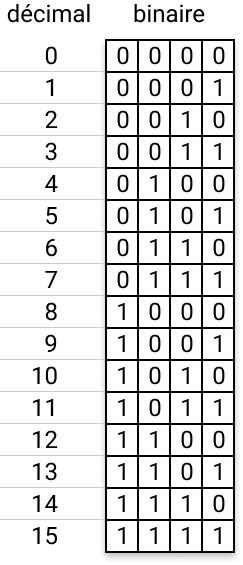
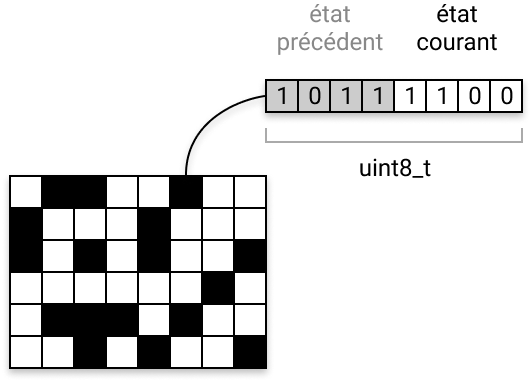
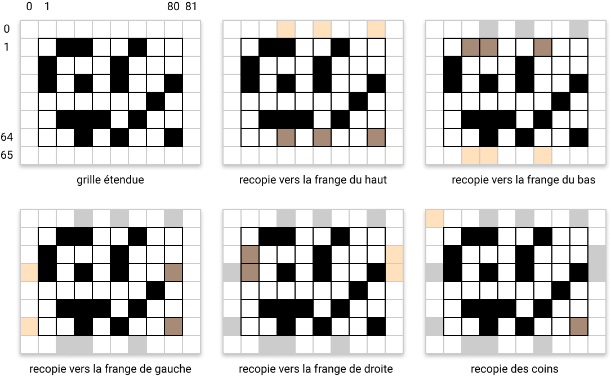
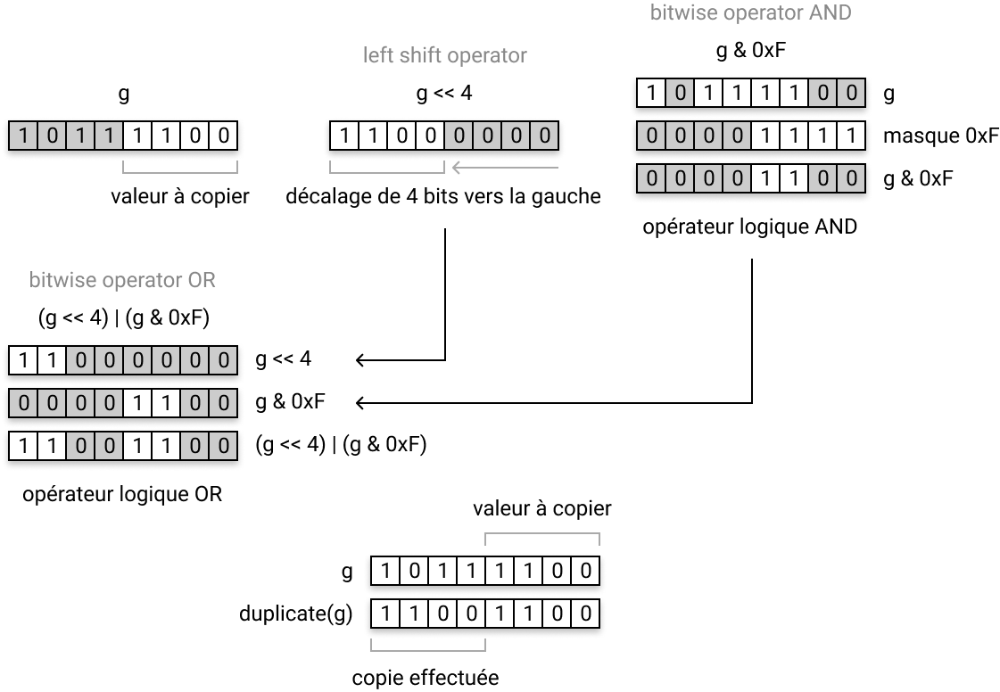
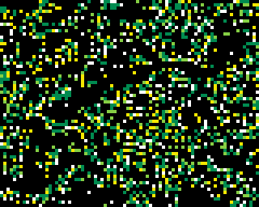

# Peut-on améliorer notre code ?

Le code que nous avons obtenu au terme du chapitre précédent est relativement court et aisément compréhensible à la lecture... Néanmoins, il n'est pas du tout satisfaisant au regard de ses performances à l'exécution ! Et ce serait terriblement frustrant si on devait s'en tenir là du fait des capacités limitées de la META, mais vous allez voir qu'il est encore possible de l'améliorer pour obtenir de bien meilleures performances. C'est ce que nous allons précisément examiner dans ce chapitre.

Avant d'aller plus loin, je vous suggère d'aller jeter un oeil sur la [contribution de sautax](https://gamebuino.com/creations/wip-conway-s-game-of-life-meta) qui avait déjà publié une implémentation du Jeu de la Vie, il y a 2 mois, dans la rubrique *Créations* du site officiel de notre console préférée. J'ai découvert sa création après avoir commencé la mienne, mais je trouve justement très intéressant de comparer nos approches. Le code source de **sautax** est [disponible ici](https://github.com/sautax/game-of-life-gamebuino). En particulier, dans le fichier `update.ino`, examinez les fonctions `updateG()` et `neighbours(grid, x, y)`...

> **sautax**, si tu lis ces lignes, je te serais très reconnaissant de ne pas supprimer ton dépôt et de laisser intacte cette version de ton code... Merci infiniment. <i class="far fa-smile-wink"></i>

La modélisation de l'automate et l'architecture globale de son application sont sensiblement les mêmes que les nôtres. Et pourtant... si vous exécutez son code, vous verrez que ses performances sont bien meilleures. Testez le sur votre console ou sur [l'émulateur d'aoneill](http://games.aoneill.com/meta-emulator/), vous allez voir...

Rien ne vaut quelques mesures pour comparer objectivement les performances respectives de nos codes. Si on mesure la durée moyenne nécessaire à l'exécution d'un cycle complet de simulation, *i.e.* :

1. recopier la grille dans le tampon
2. appliquer les règles d'évolution à l'ensemble des cellules
3. effacer l'écran
4. afficher la nouvelle génération

Voilà ce que l'on obtient (j'ai ajouté le nombre de *frames par secondes* équivalent, ainsi que l'espace mémoire disponible) :

|    code    | cycle  | fréquence | RAM libre  |
|:----------:|-------:|----------:|-----------:|
|   **v1**   | 109 ms |     9 fps | 4907 bytes |
| **sautax** |  49 ms |    20 fps | 4779 bytes |

Vous voyez que la différence est de taille en ce qui concerne la rapidité d'exécution ! Mais alors comment a-t-il fait ?... C'est très simple : il a (volontairement ou non) limité les opérations arithmétiques intervenant principalement dans sa fonction `neighbours(x,y)`. En effet, plutôt que de parcourir le voisinage d'une cellule à l'aide de deux boucles imbriquées en effectuant des opérations arithmétiques sur les coordonnées de la cellule centrale pour obtenir celles de ses voisines, il a fait le choix d'expliciter tous les accès à la grille de cellules « en dur » en effectuant de nombreux tests successifs (des `if` ... `else` ...) pour identifier tous les cas possibles, et en particulier les cellules de bordure, et ne pas risquer de sortir des limites de la grille. Le code qui en résulte est, du coup, beaucoup plus long et beaucoup moins lisible ! Mais... il est assurément plus rapide que le nôtre, car les opérations qu'il effectue sont, en définitive, moins coûteuses pour le processeur. Et c'est précisément cette *petite* différence d'écriture qui fait justement *toute* la différence à l'exécution ! En effet, la fonction `neighbours(x,y)` est appelée autant de fois qu'il y a de cellules dans la grille... donc `80 x 64 = 5120` fois à chaque génération. Vous réalisez donc que quelques fractions de secondes économisées à chaque passage dans cette fonction peut vous faire gagner plusieurs secondes au fil des générations. La conséquence : il calcule 20 générations quand on n'en calcule que 9 de notre côté... y'a pas photo !

> **La morale de cette histoire** :  
> Ce ne sont pas forcément les codes les plus courts qui sont les plus rapides !

Bon... par contre, il a une curieuse façon de gérer son tampon : il est volatile, c'est-à-dire qu'il réserve l'espace mémoire nécessaire à chaque génération, effectue ses calculs, et le détruit. Ça n'a pas grand intérêt, sachant qu'il ne peut s'en passer et qu'il va de toutes façons le recréer à chaque nouvelle génération... sinon à fragmenter la mémoire (et donc diminuer les performances à la longue). L'espace occupé par ce tampon est nécessaire, il ne peut en faire l'économie. Donc pourquoi multiplier les réservations / libérations de mémoire ?... Je ne vois pas.

Alors ? Peut-on améliorer notre code de façon à ce qu'il soit à la fois aussi rapide que celui de **sautax**, qu'il consomme moins de mémoire, mais qu'il soit également plus *élégant*, c'est-à-dire plus concis, plus astucieux mais reste facile à comprendre à la lecture ? La réponse est... **oui** <i class="far fa-smile-wink"></i>


# Comment allons-nous procéder ?

Rappelons que nous cherchons à obtenir un code qui soit à la fois plus rapide, et moins gourmand en consommation mémoire. Commençons par analyser ce que nous pouvons améliorer pour occuper moins d'espace en RAM.

## Optimiser l'occupation mémoire

Nous devons nous interroger ici sur la manière dont on code l'information qui permet de décrire l'état de l'automate d'une génération à l'autre. Nous avons besoin de représenter l'état de `80 x 64` cellules, en considérant que chaque cellule peut avoir 16 états différents (dans la mesure où l'on souhaite animer notre automate en affichant des pixels dont la couleur peut être choisie dans une palette de 16 couleurs au total). Mais n'oublions pas que, pour calculer les états des cellules d'une nouvelle génération, nous avons également besoin de mémoriser les états de ces mêmes cellules à la génération précédente.

Pour ce faire nous avions décidé de coder cette information sur 2 tableaux d'entiers à deux dimensions :

```c++
uint8_t grid[W][H];
uint8_t buffer[W][H];
```

`uint8_t` étant le type d'entier le plus *léger* dont nous disposons. Il est suffisant pour coder des entiers compris entre `0` et `16`. En effet, les données que manipule le processeur et qui sont stockées en RAM sont exprimées sous une forme **binaire**, c'est-à-dire sous la forme de séquences de **bits** (qui est la plus petite unité d'information) pouvant chacun prendre les valeurs `0` ou `1`. Dans notre, cas, coder des entiers compris entre `0` et `15` revient à coder des séquences de bits de la manière suivante :

{: width="121" height="282" }

Vous voyez que nous n'avons besoin que de `4` bits pour coder des entiers compris entre `0` et `15`. De manière générale, sur **n bits**, on peut coder jusqu'à **2<sup>n</sup>** entiers distincts. Mais les tableaux que nous avons déclarés stockent des entiers de type `uint8_t`. Ce type permet de coder des entiers non signés (pas de valeurs négatives... tout est positif) sur **1 octet**, c'est-à-dire **8 bits**. Or, avec **8 bits**, on peut coder <strong>2<sup>8</sup> = 256</strong> entiers de valeurs différentes... On n'a pas besoin d'autant de possibilités : `4` bits nous suffisent.

> Et c'est précisément là que réside l'astuce que nous pouvons exploiter pour faire des économies de mémoire !

Sur un `uint8_t` on dispose de `8` bits... mais `4` nous suffisent... oui, mais... `4` pour une cellule du tableau `grid` qui code l'état de la génération courante... et n'oublions pas qu'il nous en faudra également `4` pour coder l'état de cette même cellule à la génération précédente, jusque là stocké dans le tableau `buffer` !...

<div style="margin:1em 0;text-align:center;font-weight:bold;color:#f80;text-shadow:0 1px 1px #ccc;">
    <i class="far fa-lightbulb"></i>
    <i class="far fa-lightbulb"></i>
    <i class="far fa-lightbulb"></i>
    ... vous voyez où je veux en venir ?...
    <i class="far fa-lightbulb"></i>
    <i class="far fa-lightbulb"></i>
    <i class="far fa-lightbulb"></i>
</div>

Pourquoi ne pas rassembler l'état courant de la cellule, et son état à la génération précédente, dans le **même** tableau ?... `4 + 4 = 8` bits <i class="far fa-smile-wink"></i> !
Comme ça on exploite pleinement la taille allouée d'un `uint8_t` pour chaque cellule. C'est pile-poil ce dont on a besoin... pas un bit de moins, pas un bit de plus ! Nous verrons un peu plus loin comment isoler les 4 bits qui nous intéressent, selon que l'on souhaite lire l'état courant d'une cellule, ou celui qu'elle avait à la génération précédente.

{: width="265" height="190" }

Le modèle de données chargé de coder l'état de notre automate se limite désormais à la seule déclaration du tableau `grid` :

```c++
uint8_t grid[W][H];
// nous n'avons plus besoin du tampon
// uint8_t buffer[W][H];
```

Quelle économie avons-nous faite ? Et bien, sachant que nous avons `80 x 64` cellules nécessitant chacune 1 octet en mémoire, le tableau `grid` occupe donc `80 x 64 = 5120` octets en RAM, c'est-à-dire exactement `5` Ko. Dans notre première version, nous avions besoin de 2 tableaux de cette taille, occupant donc `10` Ko au total. S'il vous prenait l'envie de coder le Jeu de la Vie en haute résolution sur la META (`160x128` pixels), vous passeriez donc de `40` Ko à `20` Ko... c'est plutôt pas mal, d'autant qu'il vous serait impossible de coder une grille et un tampon occupant `40` Ko de RAM, puisque la META n'en a que `32` ! Vous voyez que, dans un environnement contraint comme celui de la Gamebuino, il peut être même nécessaire et incontournable de trouver des astuces pour optimiser votre programme.

Par exemple, en diminuant le nombre de couleurs affichables, et en regroupant plusieurs cellules sur le même octet, vous avez compris : on peut encore faire drastiquement chuter l'espace mémoire consommé. En admettant, par exemple qu'on se limite à deux états pour chaque cellule (morte ou vivante), avec un affichage *monochrome* du coup, `2` bits suffisent à coder les états précédent et courant d'une cellule, donc on peut regrouper `4` cellules sur le même octet et, par conséquent, la taille de notre grille serait de :

<div style="margin:1em 0;text-align:center;" markdown="1">
`80÷4 x 64 = 20 x 64 = 1280 octets = 1,25 Ko`
</div>


## Optimiser le temps de calcul

Nous allons maintenant nous pencher sur la manière dont on peut accélérer les traitements en demandant moins d'efforts au CPU. Nous avons vu au début de ce chapitre que la fonction `neighbours(x,y)` chargée de calculer le nombre de voisines vivantes d'une cellule donnée était **LE** noeud sur lequel il fallait porter notre effort d'optimisation. La manière la plus évidente d'alléger les traitements à ce niveau réside dans la limitation des opérations arithmétiques induites par le parcours du voisinage de la cellule. Et notamment les opérations consistant à s'assurer qu'on ne sort pas des limites de la grille. Pour faciliter cette étape, nous pourrions légèrement modifier la topologie de la grille pour éviter d'avoir à répéter ces opérations de contrôle à chaque passage dans la fonction `neighbours(x,y)`. L'idée consiste simplement à ajouter à notre grille une couronne de cellules reproduisant l'état de toutes les cellules des bords opposés :

{: width="542" height="334" }

La partie « visible » de la grille (celle que la fonction `draw()` se chargera d'afficher) se situe alors entre le coin supérieur gauche `(1,1)` et le coin inférieur droit `(80,64)`. Toute la rangée de cellules dont l'ordonnée vaut `0` (la frange du haut) est en fait une copie des cellules du bas de la grille visible, c'est-à-dire des cellules dont l'ordonnée vaut `64`. En reproduisant cette même logique par symétrie, verticale puis horizontale, vous aurez compris comment construire les franges du bas, de gauche et de droite sans oublier les coins ! La taille de cette nouvelle grille passe donc de `80x64` à `82x66`, *i.e.* à `(W+2)x(H+2)`. Cette petite astuce ne nous coûtera que 292 octets de mémoire supplémentaire... c'est tout à fait raisonnable. Et c'est la fonction `bufferize()` qui se chargera d'effectuer cette préparation.


# Passons à l'implémentation

Commençons par déclarer notre nouvelle grille et par réécrire la fonction `randomize()` pour qu'elle prenne en compte sa nouvelle topologie :

```c++
uint8_t grid[W+2][H+2];

void randomize() {
    size_t x,y;
    size_t xsup = W+1; // borne supérieure de x
    size_t ysup = H+1; // borne supérieure de y
    for (y=1; y<ysup; y++) {
        for (x=1; x<xsup; x++) {
            grid[x][y] = random(0,2) == 0 ? random(1, 4) : 0;
        }
    }
}
```

La fonction `randomize()` écrit désormais dans la partie visible de la grille, c'est-à-dire entre les coordonnées `(1,1)` et `(80,64)`. Et quelle que soit la valeur aléatoire tirée (même sur une échelle de `0` à `15`), ce ne sont que les `4` derniers bits de l'octet qui sont impactés : on les appelle les bits de *poids faible*, car ils correspondent aux puissances de `2` les plus petites (de `0` à `3`).

{: width="137" height="54" }

Vous remarquerez au passage que nous précalculons les bornes supérieures de `x` et `y` avant d'entrer dans les boucles, pour éviter de recalculer systématiquement leurs valeurs lors des tests d'arrêt de chaque boucle. Ce sont de *petits* détails, mais en accumulant les petits détails comme celui-là, on optimise encore la durée des calculs, contre une perte de mémoire insignifiante (l'espace occupé par les variables `xsup` et `ysup`).

Passons maintenant aux choses sérieuses... avec la fonction `bufferize()` :

```c++
uint8_t duplicate(uint8_t g) {
    return (g << 4) | (g & 0xF);
}

void bufferize() {
    size_t x,y;
    size_t w = W+1;
    size_t h = H+1;
    size_t xsup = W+2;
    size_t ysup = H+2;

    for (y=1; y<ysup; y++) {
        for (x=1; x<xsup; x++) {
            // recopie de la partie visible de la grille
            grid[x][y] = duplicate(grid[x][y]);
        }
        // recopie vers la frange de gauche
        grid[0][y] = duplicate(grid[W][y]);
        // recopie vers la frange de droite
        grid[w][y] = duplicate(grid[1][y]);
    }

    for (x=1; x<xsup; x++) {
        // recopie vers la frange du haut
        grid[x][0] = duplicate(grid[x][H]);
        // recopie vers la frange du bas
        grid[x][h] = duplicate(grid[x][1]);
    }

    // recopie des coins
    grid[0][0] = duplicate(grid[W][H]);
    grid[w][0] = duplicate(grid[1][H]);
    grid[0][h] = duplicate(grid[W][1]);
    grid[w][h] = duplicate(grid[1][1]);
}
```

Comme vous le voyez, nous avons veillé à limiter au maximum les opérations arithmétiques en précalculant les coordonnées des cellules de bordure que nous allons réutiliser à chaque itération, ainsi que les bornes supérieures des coordonnées `x` et `y` qui sont utilisées dans les tests d'arrêt de nos boucles.

Regardons maintenant d'un peu plus près la fonction `duplicate(g)` où `g` est l'état d'une cellule de la grille :

```c++
uint8_t duplicate(uint8_t g) {
    return (g << 4) | (g & 0xF);
}
```

Voilà en substance ce qui se passe dans cette fonction :

{: width="560" height="388" }

Ces opérations directes sur les bits sont traitées beaucoup plus rapidement par le processeur que les opérations arithmétiques classiques. C'est précisément la clef de l'optimisation de notre code. <i class="far fa-smile-wink"></i>

Vous pouvez jeter un oeil sur [cette page Wikipedia](https://en.wikipedia.org/wiki/Bitwise_operations_in_C) qui détaille l'ensemble des opérateurs sur les bits qui existent en C (et qui restent les mêmes en C++).

Maintenant que la copie des états des cellules à la génération précédente est garantie, nous pouvons facilement réécrire la fonction `neighbours(x,y)` chargée de calculer le nombre de voisines vivantes autour d'une cellule :

```c++
uint8_t neighbours(size_t x, size_t y) {
    uint8_t n = 0;
    size_t x1 = x-1;
    size_t x2 = x+1;
    size_t y1 = y-1;
    size_t y2 = y+1;

    if (grid[x1][y1] & 0xF0) { n++; }
    if (grid[x][y1]  & 0xF0) { n++; }
    if (grid[x2][y1] & 0xF0) { n++; }
    if (grid[x1][y]  & 0xF0) { n++; }
    if (grid[x2][y]  & 0xF0) { n++; }
    if (grid[x1][y2] & 0xF0) { n++; }
    if (grid[x][y2]  & 0xF0) { n++; }
    if (grid[x2][y2] & 0xF0) { n++; }
    
    return n;
}
```

Il suffit en effet d'extraire la valeur stockée sur les `4` bits de poids fort (les `4` bits les plus à gauche) de chaque octet de la grille en utilisant l'opérateur logique `AND` et le masque `0xF0` qui *éteint* les bits de poids faibles. Là encore, tous les calculs préliminaires sont effectués une fois, pour ne pas recalculer inutilement les coordonnées des cellules à examiner.

Nous pouvons maintenant réécrire la fonction `applyRules(x,y)` chargée d'appliquer les règles d'évolution de l'automate :

```c++
void applyRules() {
    uint8_t n,g,b;
    size_t x,y;
    size_t xsup = W+1;
    size_t ysup = H+1;

    for (y=1; y<ysup; y++) {
        for (x=1; x<xsup; x++) {
            n = neighbours(x,y);
            // l'état courant de la cellule
            g = grid[x][y] & 0xF;
            // l'état de la cellule à la génération précédente
            b = grid[x][y] & 0xF0;
            if (g == 0) { // si la cellule est morte
                if (n == 3) {
                    g = 1;
                }
            } else { // sinon c'est qu'elle est vivante
                if (n == 2 || n == 3) {
                    if (g != 15) {
                        g++;
                    }
                } else {
                    g = 0;
                }
            }
            // on n'oublie pas de conserver l'état de la cellule
            // à la génération précédente, puisque la grille n'a
            // pas encore été totalement parcourue !
            grid[x][y] = b | g;
        }
    }
}
```

Il ne nous reste plus qu'à réécrire la fonction `draw()` qui affichera la nouvelle grille à chaque pas de la simulation. Rien de spécial à dire ici, si ce n'est qu'il faut juste ne pas oublier que la partie visible de la grille, qui commence aux coordonnées `(1,1)` doit être affichée à l'écran, dont l'origine est `(0,0)` ... donc il faut afficher `grid[x+1][y+1]` avec `gb.display.drawPixel(x,y)` :

```c++
void draw() {
    uint8_t i,j,y,g;
    gb.display.clear();
    for (i=0; i<H; i++) {
        y = i+1;
        for (j=0; j<W; j++) {
            g = grid[j+1][y] & 0xF;
            if (g) {
                gb.display.setColor(PALETTE[g]);
                gb.display.drawPixel(j,i);
            }
        }
    }
}
```

Et maintenant ? Ça donne quoi ?...

{: width="320" height="256" class="shadow"}

Haaaaa... ben c'est quand même mieux comme ça nan ?

Voyons un peu ce que donnent les nouvelles mesures de performances :

|    code    | cycle  | fréquence | RAM libre  |
|:----------:|-------:|----------:|-----------:|
|   **v1**   | 109 ms |     9 fps | 4907 bytes |
|   **v2**   |  35 ms |    28 fps | 9723 bytes |
| **sautax** |  49 ms |    20 fps | 4779 bytes |

<div style="margin:1.5rem 0;font-size:3em;text-align:center;">🍺</div>

Théoriquement on pourrait atteindre les 28 frames par secondes, mais on se limitera aux 25 fps standards de la META. Vous voyez que les quelques améliorations que nous avons apportées à notre version initiale ont eu un impact réel sur les performances que l'on obtient désormais : on a quand même multiplié la vitesse d'exécution par `3` ! Et en plus on ~~bouffe~~ consomme moins de RAM !

Le code source complet de cette deuxième version est [disponible ici]({{ site.github.repository_url | append: '/blob/master/sources/v2/GameOfLife/GameOfLife.ino' }}).