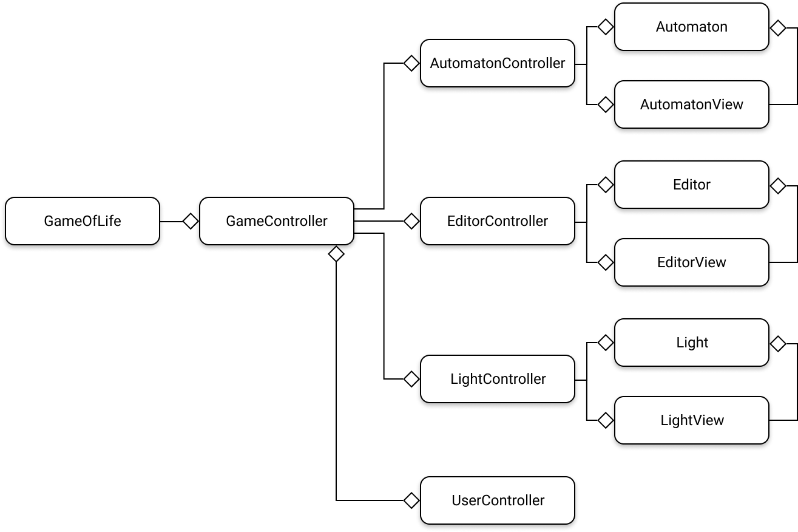
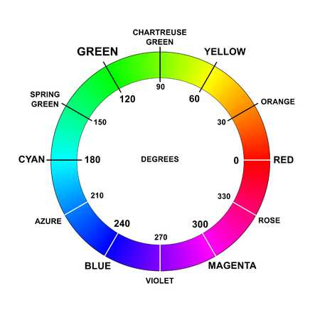
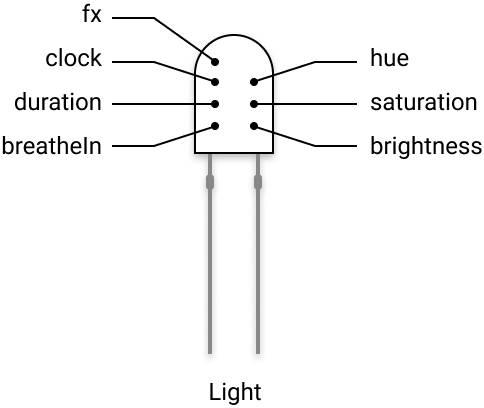
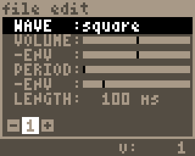
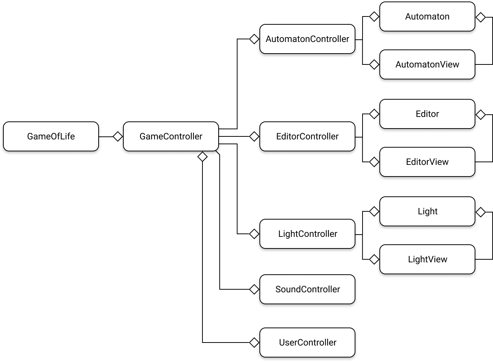

# Activation des LEDs de la META

Commençons par illuminer un peu notre application. La Gamebuino META est assortie de 8 LEDs sur sa face arrière et nous allons voir comment les utiliser. En préambule, je vous encourage à lire l'article [Lights](https://gamebuino.com/creations/lights) de [*Soru*](https://gamebuino.com/@Sorunome), qu'on n'a plus besoin de présenter.

L'article explique comment activer les LEDs indépendamment les unes des autres avec la fonction `gb.lights.drawPixels`, mais nous nous contenterons ici de traiter les LEDs comme un groupe indivisible en leur affectant la même couleur simultanément, quoique nous fassions. L'intérêt principal de ce chapitre est plutôt de comprendre comment gérer les couleurs et la luminosité des LEDs pour produire des petits effets comme des flashs ou des fondus.

Fidèle à nos principes, nous allons créer un gestionnaire spécialisé pour gérer cela, qui sera construit selon l'architecture MVC :

- `Light` : le modèle
- `LightView` : la vue
- `LightController` : le contrôleur




## Un petit peu de théorie

Nous ne souhaitons pas nous limiter aux actions binaires **allumer** / **éteindre** les LEDs... Ça n'a pas grand intérêt en soi. Par contre, ce qui va davantage nous intéresser c'est comprendre comment faire *flasher* les LEDs par exemple. C'est-à-dire les allumer (ou les éteindre) de manière progressive, en faisant varier leur luminosité dans le temps, de manière plus ou moins rapide, et pour une teinte donnée.

Il faut avouer que le modèle colorimétrique RGB565 sous-jacent aux opérations d'affichage sur la META, que ce soit à l'écran ou sur les LEDs, n'est pas très pratique pour gérer proprement les notions de teinte, de saturation des couleurs et de luminosité.

RGB565
:   - 5 bits sont consacrés au codage de la teinte primaire rouge
    - 6 bits sont consacrés au codage de la teinte primaire verte
    - 5 bits sont consacrés au codage de la teinte primaire bleue

Aussi, une des choses primordiales que nous nous attacherons à faire, c'est de coder une fonction qui nous permette de changer de référentiel, pour pouvoir travailler plus facilement avec le modèle [**HSB**](https://fr.wikipedia.org/wiki/Teinte_Saturation_Valeur) (Hue / Saturation / Brightness) également désigné par le sigle **HSV**.

> **Soru**, if you read these lines, perhaps you'll have the (good) idea to add some transcoding functions in the Gamebuino-Meta API which makes it possible to pass from the HSB color model to the RGB888 or RGB565, and *vice versa*, e.g. `rgb2hsv()` and `hsv2rgb()` ?  <i class="far fa-smile-wink"></i>

C'est en effet beaucoup plus simple de pouvoir paramétrer la teinte que l'on souhaite affecter aux LEDs dans ce référentiel :

{: width="225" height="225" class="shadow" }

L'API de la META nous propose la fonction [`gb.createColor()`](https://gamebuino.com/academy/reference/gb-createcolor) qui nous permet de passer du référentiel RGB888 vers le référentiel RGB565. C'est déjà pas mal !

```c++
Color gb.createColor(uint8_t red, uint8_t green, uint8_t blue);
```

En effet, cette fonction accepte des valeurs comprises entre `0` et `255` pour les trois niveaux primaires `red`, `green` et `blue` (donc dans le référentiel RGB888) et nous sort la couleur la plus proche dans le référentiel RGB565. Nous nous attacherons donc à coder une fonction qui nous permette de passer du référentiel HSB au référentiel RGB888. On peut trouver l'algorithme facilement sur le Net. Il figure d'ailleurs sur la [page Wikipedia consacrée au modèle HSB](https://fr.wikipedia.org/wiki/Teinte_Saturation_Valeur).

Ensuite, pour allumer ou éteindre les LEDs de manière progressive, nous utiliserons des fonctions dites de ***easing***. Vous avez peut-être déjà joué avec dans vos CSS pour ajouter des effets de transitions sur les propriétés des éléments HTML (couleur, taille, position, etc.). Vous trouverez [ici](https://easings.net/fr) une représentation graphique des plus communes. Ne vous inquiétez pas, je vous donnerai le code de celles que nous utiliserons. Je me souviens avoir lu, *quand j'étais p'tit* et que je codais encore en **ActionScript**, un super bouquin sur le sujet, de Robert Penner, et dont je viens de retrouver [le Saint chapitre](http://robertpenner.com/easing/penner_chapter7_tweening.pdf) concernant les fonctions analytiques du mouvement. Nous nous appuierons d'ailleurs sur ses équations, qui sont devenues célèbres depuis.

> Vous voyez que c'est pas si simple d'allumer ou d'éteindre des LEDs hein... faut un peu de culture mathématique pour en envoyer plein la vue à vos potes.  <i class="far fa-smile-wink"></i>


## Le modèle Light

Voici le modèle que nous allons nous attacher à définir :

{: width="242" height="204" }

Je vous détaille ses propriétés directement dans le code :

<div class="filename">Light.h</div>

```c++
#ifndef GAME_OF_LIFE_LIGHT_H_
#define GAME_OF_LIFE_LIGHT_H_

#include "bootstrap.h"

class Light
{
    private:

        // liste des états possibles des LEDs :
        // chaque état correspond à un effet lumineux appliqué aux LEDs
        //
        // aucun effet actif
        static const uint8_t FX_NONE;
        // les LEDs s'illuminent brièvement par un flash
        static const uint8_t FX_FLASH;
        // les LEDs s'illuminent continuellement comme si elles "respiraient"
        static const uint8_t FX_BREATHE;

        // teinte appliquée sur les LEDs
        float hue;
        // niveau de saturation de la teinte appliquée sur les LEDs
        float saturation;
        // niveau de luminosité des LEDs
        float brightness;

        // effet appliqué sur les LEDs (parmi FX_NONE, FX_FLASH et FX_BREATHE)
        uint8_t fx;
        // horloge interne du modèle
        uint8_t clock;
        // durée (en nombre de frames) de l'effet appliqué sur les LEDs
        float duration;
        // flag qui indique si on est en phase d'inspiration ou d'expiration
        // lorsque l'effet de respiration est appliqué sur les LEDs
        bool breatheIn;

        // boucle exécutée lorsque l'effet FX_FLASH est appliqué
        void flashLoop();
        // boucle exécutée lorsque l'effet FX_BREATHE est appliqué
        void breatheLoop();

        // fonctions de *easing* utilisées pour
        // faire varier la luminosté des LEDs
        float easeInOutQuad(float t, float b, float c, float d);
        float easeOutCubic(float t, float b, float c, float d);

    public:

        Light();

        // retourne la teinte des LEDs
        float getHue();
        // retourne le niveau de saturation des LEDs
        float getSaturation();
        // retourne le niveau de luminosité des LEDs
        float getBrightness();
        // boucle principale
        void loop();
        // éteint immédiatement les LEDs
        void off();
        // applique l'effet FX_FLASH aux LEDs
        void flash(float hue, float duration);
        // applique l'effet FX_BREATHE aux LEDs
        void breathe(float hue, float period);
        
};

#endif
```

Voilà, rien de bien compliqué en soi. Passons à la définition de la classe maintenant :

<div class="filename">Light.cpp</div>

```c++
#include "Light.h"

// on définit l'ensemble des états possibles
const uint8_t Light::FX_NONE    = 0;
const uint8_t Light::FX_FLASH   = 1;
const uint8_t Light::FX_BREATHE = 2;

// le constructeur fixe toutes les propriétés par défaut
Light::Light() {
    this->hue = 0;
    this->saturation = 1;
    this->brightness = 0;
    this->fx = FX_NONE;
    this->clock = 0;
    this->duration = 1;
    this->breatheIn = true;
}

// méthode d'accès à la teinte
float Light::getHue() {
    return this->hue;
}

// méthode d'accès au niveau de saturation de la teinte
float Light::getSaturation() {
    return this->saturation;
}

// méthode d'accès au niveau de luminosité
float Light::getBrightness() {
    return this->brightness;
}

// boucle principale qui effectue un aiguillage
// sur la boucle dérivée selon l'effet appliqué
// (si aucun effet n'est appliqué, la boucle ne fait rien)
void Light::loop() {
    switch (this->fx) {
        case FX_FLASH:
            this->flashLoop();
            break;
        case FX_BREATHE:
            this->breatheLoop();
            break;
    }
}

// boucle exécutée lorsque l'effet FX_FLASH et appliqué
void Light::flashLoop() {
    // l'horloge interne...
    float t = (float)this->clock++;
    // ...est utilisée comme variable temporelle dans les fonctions d'easing
    this->brightness = this->easeOutCubic(t, 1.0, -1.0, this->duration);

    // si l'horloge atteint la durée (en nombre de frames) pendant laquelle
    // l'effet devait être appliqué...
    if (this->clock >= this->duration) {
        // ... on éteint les LEDs
        this->off();
    }
}

// boucle exécutée lorsque l'effet FX_BREATHE et appliqué
void Light::breatheLoop() {
    float t = (float)this->clock++;
    // ici les paramètres `b` et `c` des fonctions d'easing ont des valeurs
    // alternées selon qu'on est en phase d'inspiration ou d'expiration
    float b = this->breatheIn ? 0.0 :  1.0;
    float c = this->breatheIn ? 1.0 : -1.0;
    this->brightness = this->easeInOutQuad(t, b, c, this->duration);

    // si l'horloge atteint la durée (en nombre de frames) pendant laquelle
    // l'effet devait être appliqué...
    if (this->clock >= this->duration) {
        // c'est reparti pour un tour
        this->clock = 0;
        // en alternant la phase
        this->breatheIn = !this->breatheIn;
    }
}

// extinction des LEDs
void Light::off() {
    this->fx = FX_NONE;
    this->brightness = 0;
}

// applique l'effet FX_FLASH aux LEDs avec :
// - une teinte comprise dans l'intervalle [0,360]
// - une durée exprimée en secondes
void Light::flash(float hue, float duration) {
    this->fx = FX_FLASH;
    this->hue = hue;
    this->clock = 0;
    this->duration = duration * 25.0;
}

// applique l'effet FX_BREATHE aux LEDs
// - une teinte comprise dans l'intervalle [0,360]
// - une période exprimée en secondes
void Light::breathe(float hue, float period) {
    this->fx = FX_BREATHE;
    this->hue = hue;
    this->clock = 0;
    this->duration = period * .5 * 25.0;
    this->breatheIn = true;
}

// fonction quadratique de easing
float Light::easeInOutQuad(float t, float b, float c, float d) {
    t /= d/2;
    if (t < 1) return c/2*t*t + b;
    t--;
    return -c/2 * (t*(t-2) - 1) + b;
}

// fonction cubique de easing
float Light::easeOutCubic(float t, float b, float c, float d) {
    t /= d;
    t--;
    return c*(t*t*t + 1) + b;
}
```

J'vous rassure... on a fait le plus dur !


## La vue LightView

Très peu de choses ici :

<div class="filename">LightView.h</div>

```c++
#ifndef GAME_OF_LIFE_LIGHT_VIEW_H_
#define GAME_OF_LIFE_LIGHT_VIEW_H_

#include "bootstrap.h"
#include "Light.h"

class LightView
{
    private:

        // la référence au modèle
        Light* model;

        // la méthode de conversion HSB -> RGB888 -> RGB565
        Color createColor(float hue, float saturation, float brightness);

    public:

        LightView(Light* model);
        
        void draw();
};

#endif
```

<div class="filename">LightView.cpp</div>

```c++
#include "LightView.h"
#include "bootstrap.h"

LightView::LightView(Light* model) : model(model) {

}

// la méthode d'affichage est très simple :
// - on détermine les valeurs courantes HSB du modèle
// - on construit une couleur RGB565 à partir de ces valeurs
// - et on applique cette couleur à toutes les LEDs en même temps
void LightView::draw() {
    float h = this->model->getHue();
    float s = this->model->getSaturation();
    float b = this->model->getBrightness();
    Color color = this->createColor(h, s, b);
    gb.lights.fill(color);
}

// la fameuse méthode de conversion HSB -> RGB888 -> RGB565
Color LightView::createColor(float hue, float saturation, float brightness) {
    float r = 0, g = 0, b = 0;
    float v = brightness;

    if (saturation == 0.0) {
        r = v;
        g = v;
        b = v;
    } else {
        int i;
        float f, p, q, t;
        if (hue == 360.0) { hue = 0; } else { hue /= 60; }
        i = (int)trunc(hue);
        f = hue - i;
        p = v * (1.0 - saturation);
        q = v * (1.0 - f * saturation);
        t = v * (1.0 - (1.0 - f) * saturation);

        switch (i) {
            case 0:  r = v; g = t; b = p; break;
            case 1:  r = q; g = v; b = p; break;
            case 2:  r = p; g = v; b = t; break;
            case 3:  r = p; g = q; b = v; break;
            case 4:  r = t; g = p; b = v; break;
            default: r = v; g = p; b = q;
        }
    }

    // ici on obtient une couleur RGB888
    int red   = (uint8_t)(r * 255);
    int green = (uint8_t)(g * 255);
    int blue  = (uint8_t)(b * 255);

    // conversion RGB888 -> RGB565
    return gb.createColor(red, green, blue);
}
```


## Le contrôleur LightController

<div class="filename">LightController.h</div>

```c++
#ifndef GAME_OF_LIFE_LIGHT_CONTROLLER_H_
#define GAME_OF_LIFE_LIGHT_CONTROLLER_H_

#include "bootstrap.h"
#include "Light.h"
#include "LightView.h"

class LightController
{
    private:

        // les références au modèle et à la vue
        Light* model;
        LightView* view;

    public:

        LightController(Light* model, LightView* view);
        
        // les points d'entrée classiques
        void begin();
        void loop();

        // extinction des LEDs
        void off();

        // application des effets sur les LEDs
        void flash(float hue, float duration);
        void breathe(float hue, float period);
};

#endif
```

La définition est excessivement simple :

<div class="filename">LightController.cpp</div>

```c++
#include "LightController.h"

LightController::LightController(Light* model, LightView* view) : model(model), view(view) {

}

void LightController::begin() {
    
}

void LightController::loop() {
    this->model->loop();
    this->view->draw();
}

void LightController::off() {
    this->model->off();
    this->view->draw();
}

void LightController::flash(float hue, float duration) {
    this->model->flash(hue, duration);
}

void LightController::breathe(float hue, float period) {
    this->model->breathe(hue, period);
}
```


## Intégration dans l'application

Il ne nous reste plus qu'à recâbler tout ça avec notre `GameController` :

<div class="filename">GameController.h</div>

```c++
#include "LightController.h"

class GameController
{
    private:

        LightController* lightController;

        void initLightController();
    
    public:

        void lightOff();

    // le reste des déclarations reste inchangé
};
```

<div class="filename">GameController.cpp</div>

```c++
GameController::GameController() : state(STATE_SUSPENDED) {
    this->initAutomatonController();
    this->initEditorController();
    // on initialise le LightController
    this->initLightController();
    this->initUserController();
}

// initialisation du LightController
void GameController::initLightController() {
    Light* light = new Light();
    LightView* lightView = new LightView(light);
    this->lightController = new LightController(light, lightView);
}

// on active les différents contrôleurs
void GameController::begin() {
    this->automatonController->begin();
    this->editorController->begin();
    // et en particulier le LightController
    this->lightController->begin();
    this->userController->begin();
    this->start();
}

void GameController::loop() {
    // on déclenche l'exécution de la boucle du LightController
    this->lightController->loop();
    this->userController->loop();

    if (this->state == STATE_RUNNING) {
        this->automatonController->loop();
    } else if (this->state == STATE_EDITING) {
        this->editorController->loop();
    }
}

void GameController::start() {
    this->state = STATE_RUNNING;
    // on active l'effet de "respiration" sur les LEDs
    this->lightController->breathe(100, .5);
}

void GameController::stop() {
    this->state = STATE_SUSPENDED;
    // on fait flasher brièvement les LEDs
    this->lightController->flash(10, .25);
}

void GameController::step() {
    // on fait flasher brièvement les LEDs
    this->lightController->flash(10, .1);
    this->automatonController->step();
}

void GameController::startEdit() {
    this->state = STATE_EDITING;
    // on active l'effet de "respiration" sur les LEDs avec une autre teinte
    this->lightController->breathe(240, 2.0);
}

void GameController::stopEdit() {
    this->state = STATE_SUSPENDED;
    // on fait flasher brièvement les LEDs avec une autre teinte
    this->lightController->flash(180, .25);
}

// extinction des LEDs
void GameController::lightOff() {
    this->lightController->off();
}

// le reste des définitions reste inchangé
```

Et voilà, tout est désormais fonctionnel ! Les LEDs flashent en rouge orangé lorsqu'on appuie sur le bouton `B` pour suspendre la simulation ou qu'on avance pas à pas. Les LEDs respirent en vert lorsque la simulation est (re)lancée. Et les LEDs respirent en bleu lorsqu'on est en mode édition. Effets garantis !

Tiens d'ailleurs, pour rester dans le ton du mode édition, j'ai juste modifié la valeur affectée à la cellule `grid[x][y]` quand l'utilisateur engendre une cellule vivante de façon à ce qu'elle soit affichée avec la couleur `LIGHTBLUE` et non plus `LIGHTGREEN` :

<div class="filename">Automaton.cpp</div>

```c++
void Automaton::spawn(size_t x, size_t y) {
    this->grid[x][y] = 13; // remplace la valeur 2 intialement affectée ici
}
```

Voilà une petite démo rapide de ce que ça donne :

<iframe class="shadow" width="560" height="315" src="https://www.youtube.com/embed/v6lZV-E1U3w" frameborder="0" allow="autoplay; encrypted-media" allowfullscreen></iframe>


# Intégration des effets sonores

Après la gestion de la lumière, passons à la gestion du son ! L'API de la bibliothèque `Gamebuino-Meta` fournit un ensemble de fonctions `gb.sound.*` qui permet de jouer des sons de différentes manières. Nous nous intéresserons exclusivement ici aux *effets sonores*. Nous n'intégrerons pas de musique dans notre application.

Pour illustrer l'usage des effets sonores, nous jouerons :

- les sons prédéfinis avec les fonctions :
    - [`gb.sound.playTick()`](https://gamebuino.com/academy/reference/gb-sound-playtick) et
    - [`gb.sound.playOK()`](https://gamebuino.com/academy/reference/gb-sound-playok)
- un son que nous allons créer et jouer avec le fonction [`gb.sound.fx()`](https://gamebuino.com/academy/reference/gb-sound-fx)

Pour créer et jouer des sons sur la META, je vous encourage à aller jeter un coup d'oeil sur le tuto [Sound FX and Patterns](https://gamebuino.com/creations/sound-fx-and-patterns). Vous y découvrirez un petit outil très pratique : [GSFX GUI](https://gamebuino.com/creations/gamebuino-sound-fx-creation-tool-gsfx-gui), développé par [Valden](https://gamebuino.com/@Valden) que nous allons utiliser pour créer un petit effet sonore tout simple (juste pour illustrer le concept). Voici le paramétrage que j'ai utilisé pour créer ce son :

{: width="240" height="192" class="shadow" }

L'application vous permet d'exporter le code C++ correspondant pour intégrer le son dans notre application :

```c++
//Put this in your .h file :
extern const Gamebuino_Meta::Sound_FX sfx_0[];

//Put this in your .cpp file :
const Gamebuino_Meta::Sound_FX sfx_0[] = {
	{Gamebuino_Meta::Sound_FX_Wave::SQUARE,0,128,0,-80,50,5},
};
```

Ok. On est prêts ! Alors allons-y...

Nous allons créer un contrôleur spécifique pour la gestion des sons : `SoundController`.



Ce gestionnaire sera chargé de jouer des sons lorsque l'utilisateur appuiera :

- sur le bouton `A` pour lancer la simulation
- sur le bouton `B` pour suspendre ou faire progresser la simulation pas à pas
- sur le bouton `MENU` pour sortir du mode d'édition

Le code de ce contrôleur est très court :

<div class="filename">SoundController.h</div>

```c++
#ifndef GAME_OF_LIFE_SOUND_CONTROLLER_H_
#define GAME_OF_LIFE_SOUND_CONTROLLER_H_

#include "bootstrap.h"

class SoundController
{
    private:

        // voici la déclaration du Pattern que nous avons créé
        // avec GSFX GUI (qui comporte un unique son) :
        static const Gamebuino_Meta::Sound_FX SFX_START[];

    public:

        SoundController();
        
        // et voici les méthodes qui permettront au `GameController`
        // de déclencher l'exécution des effets sonores ;
        void playStart();
        void playStop();
        void playStep();
        void playStopEdit();
};

#endif
```

<div class="filename">SoundController.cpp</div>

```c++
#include "SoundController.h"

// voici la définition du Pattern que nous avons créé avec GSFX GUI :
const Gamebuino_Meta::Sound_FX SoundController::SFX_START[] = {
    // un seul effet compose le Pattern :
    {Gamebuino_Meta::Sound_FX_Wave::SQUARE, 0, 128, 0, -80, 50, 5}
};

SoundController::SoundController() {

}

void SoundController::playStart() {
    // voici comment jouer l'effet sonore que nous avons créé avec GSFX GUI :
    gb.sound.fx(SFX_START);
}

void SoundController::playStop() {
    // voici comment jouer l'effet sonore prédéfini :
    gb.sound.playTick();
}

void SoundController::playStep() {
    // et à nouveau ici :
    gb.sound.playTick();
}

void SoundController::playStopEdit() {
    // et un dernier pour la route :
    gb.sound.playOK();
}
```

Vous voyez que c'était excessivement simple ! Maintenant il ne nous reste plus qu'à connecter ce contrôleur au contrôleur principal `GameController` :

<div class="filename">GameController.h</div>

```c++
#include "SoundController.h"

class GameController
{
    private:
    
        SoundController* soundController;

        void initSoundController();
    
    // le reste des déclarations reste inchangé
};
```

<div class="filename">GameController.h</div>

```c++
GameController::GameController() : state(STATE_SUSPENDED) {
    this->initAutomatonController();
    this->initEditorController();
    this->initLightController();
    // on initialise le contrôleur de gestion du son :
    this->initSoundController();
    this->initUserController();
}

// initialisation du SoundController :
void GameController::initSoundController() {
    this->soundController = new SoundController();
}

void GameController::start() {
    this->state = STATE_RUNNING;
    // on décleclenche la lecture de l'effet sonore que nous avons créé
    // lorsque l'utilisateur relance la simulation :
    this->soundController->playStart();
    this->lightController->breathe(100, .5);
}

void GameController::stop() {
    this->state = STATE_SUSPENDED;
    // on déclenche la lecture du son prédéfini adéquat
    // lorsque l'utilisateur suspend la simulation :
    this->soundController->playStop();
    this->lightController->flash(10, .25);
}

void GameController::step() {
    // et on fait de même lorsqu'il la fait progresser pas à pas :
    this->soundController->playStep();
    this->lightController->flash(10, .1);
    this->automatonController->step();
}

void GameController::stopEdit() {
    this->state = STATE_SUSPENDED;
    // idem lrosqu'il sort du mode édition :
    this->soundController->playStopEdit();
    this->lightController->flash(180, .25);
}

// le reste des définitions reste inchangé
```

Voilà, nous en avons terminé avec la gestion du son. Vous pouvez la compléter à loisir en fonction de ce que vous voulez faire. Vous avez vu que c'est vraiment très simple.

J'ai tout de même une petite remarque à soulever ici. Lorsque vous exécuterez ce code sur votre console, vous allez constater que la lecture du son est quelque peu... dénaturée. Comme s'il y avait un dysfonctionnement. Mais je suppose qu'il n'en est rien... C'est simplement parce-que le processeur est déjà bien occupé par la simulation qu'il a du mal à exécuter la lecture des sons simultanément... C'est dommage, mais je n'ai pas réussi à faire en sorte que les sons se jouent normalement. Il faudrait trouver un moyen efficace de faire chuter la charge du CPU...

Le code source complet de cette sixième version est [disponible ici]({{ site.github.repository_url | append: '/blob/master/sources/v6/GameOfLife/' }}).